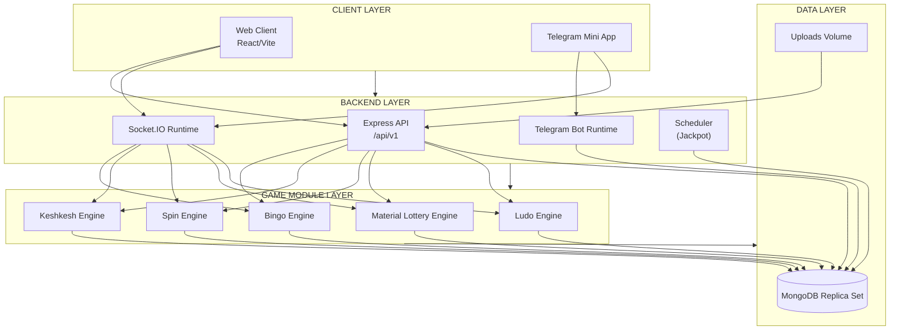

# Haywin Games - Multi-Game Gaming Platform

**Production-ready, real-time multi-game gaming platform built for the Ethiopian market.**

[](https://nodejs.org)
[](https://react.dev)
[](https://mongodb.com)
[]()

---

## Overview

Haywin Games is a **comprehensive multi-game gaming platform** featuring five game modes, secure payment integration, agent commission system, and a full-featured admin dashboard.

### Key Features

- **Multi-Game Support**: Bingo, Keshkesh (lottery), Spin (Fetan), Material Prize lottery, Ludo
- **Real-Time Gameplay**: WebSocket-powered live gaming with automatic number drawing
- **Payment Integration**: AddisPay, Telebirr, manual payments with receipt upload
- **Agent System**: Full agent management with commission tracking
- **Admin Dashboard**: Game management, user control, analytics
- **Telegram Integration**: Bot and mini-app support
- **Security**: JWT authentication, rate limiting, input validation
- **Mobile Ready**: Responsive design + Telegram Mini App

### Business Model

```
User Balance → Stake/Participation → Game Execution → Result Calculation → Settlement → Platform Margin
```

**Revenue sources:** House edge per game type, stake-pool margins after winner settlement, transaction fees on deposits/withdrawals.

---

## System Architecture



**Game integration points:**
- REST routes mount under `/api/v1/bingo`, `/keshkesh`, `/spin`, `/material-lottery`, `/ludo`
- Socket.IO engines: `bingoSocket.js`, `keshkeshSocket.js`, `spinSocket.js`, `materialLotterySocket.js`, `ludoSocket.js`

**Shared platform services:** Auth (JWT), Wallet (balance/transactions), Permissions (role checks), Config (feature flags), Notifications (Telegram/in-app).

---

## Tech Stack

| Layer | Technology | Version |
|-------|------------|---------|
| **Backend** | | |
| Runtime | Node.js | 18+ |
| Framework | Express | 5.x |
| Database | MongoDB (Replica Set) | 7.0 |
| ODM | Mongoose | 8.x |
| Real-time | Socket.IO | 4.x |
| Auth | JWT + bcryptjs | - |
| Validation | Joi, express-validator, Zod | - |
| Logging | Winston | 3.x |
| Payments | AddisPay SDK, Telebirr | - |
| Telegram | node-telegram-bot-api, telegraf | - |
| **Frontend** | | |
| Framework | React | 19.x |
| Build Tool | Vite | 7.x |
| UI Library | MUI (Material-UI) | 7.x |
| Styling | TailwindCSS | 4.x |
| State | Zustand | 5.x |
| API Client | Axios | 1.x |
| Real-time | socket.io-client | 4.x |
| Forms | react-hook-form + Zod | - |
| **Infrastructure** | | |
| Container | Docker + Docker Compose | - |
| Process Manager | PM2 (production) | - |
| Reverse Proxy | Nginx | - |

---

## Project Structure

```
ludo-bingo/
├── client/                    # React frontend (Vite + Tailwind)
│   ├── src/
│   │   ├── components/        # Reusable UI components (bingo, keshkesh, spin, ludo, jackpot)
│   │   ├── contexts/          # React Context providers
│   │   ├── hooks/             # Custom React hooks
│   │   ├── pages/             # Route pages (auth, games, user, admin)
│   │   ├── services/          # API clients
│   │   ├── store/             # Zustand stores
│   │   ├── routes/            # Route definitions
│   │   └── utils/             # Utilities
│   ├── public/                # Static assets
│   ├── Dockerfile
│   └── package.json
│
├── server/                    # Node.js/Express backend
│   ├── controllers/           # API controllers (37 files)
│   ├── models/                # MongoDB models (30 files)
│   ├── routes/                # Express routes (36 files)
│   ├── middlewares/           # Auth, validation (11 files)
│   ├── services/              # Business logic (20 files)
│   ├── socketController/      # WebSocket handlers (15 files)
│   ├── botController/         # Telegram bot (66+ files)
│   ├── config/                # Configuration
│   ├── locales/               # i18n translations
│   ├── scripts/               # Utility scripts
│   ├── uploads/               # Uploaded files
│   ├── utils/                 # Helper functions (21 files)
│   ├── Dockerfile
│   └── package.json
│
├── docs/                      # Documentation
│   ├── HAYWIN_GAMES_HANDOVER.md   # Complete technical documentation
│   ├── HAYWIN_GAMES_API_DOCUMENTATION.md  # Full API reference
│   ├── POSTMAN.md             # Postman usage guide
│   ├── ludo-bingo.docx            # document provided as srs from Mr. Marshet A.
│   └── HaywinGames.postman.json   # Postman collection + environment
│
├── docker-compose.yml         # Docker orchestration
└── nginx.conf                 # Nginx configuration
```

---

## Database Design (Core Collections)

| Collection | Purpose | Key Fields |
|------------|---------|-------------|
| `users` | User accounts | telegramId, phone, wallet, bonus, role, gamePermissions |
| `transactions` | Cashflow ledger | type, amount, status, reference, paymentMethod |
| `game_transactions` | Game financial records | gameType, type (stake/win/refund), amount, walletBefore/After |
| `gamerooms` | Bingo rooms | stakeAmount, status, bonusEnabled |
| `reservations` | Bingo card reservations | userId, roomId, cardIds |
| `games` | Keshkesh/Spin games | bet_amount, max_players, status |
| `game_participants` | Game player records | gameId, userId, numbers, stake |
| `payouts` | Game winnings | gameId, userId, amount, rank |
| `material_lotteries` | Material lottery games | name, prizeType, status |
| `ludo_rooms` | Ludo game rooms | stakeAmount, mode, playerCount, status |
| `ludo_games` | Active Ludo games | roomId, players, currentTurn, status |
| `withdrawal_requests` | Withdrawal queue | userId, amount, paymentMethod, status |
| `receipts` | Manual payment proofs | userId, amount, imageUrl, status |

---

## Quick Start

### Prerequisites
- Node.js v18+
- MongoDB 5.0+ (or use Docker)
- pnpm (recommended) or npm
- Telegram Bot Token (optional)
- AddisPay credentials (optional)

### Installation

```bash
git clone https://github.com/abyssiniasoftware/haywin-bingo-and-ludo.git ludo-bingo
cd ludo-bingo

# Install server dependencies
cd server && pnpm install

# Install client dependencies
cd ../client && pnpm install
```

### Environment Setup

```bash
# Server environment (from server/)
cp .env.example .env
# Edit with MongoDB URL, JWT secret, etc.

# Client environment (from client/)
cp .env.example .env
# Edit with backend API URL (VITE_APP_API_URL)
```

### Running Locally

```bash
# Terminal 1: Server
cd server && pnpm run dev   # http://localhost:5000

# Terminal 2: Client
cd client && pnpm run dev   # http://localhost:5173
```

### Docker Quick Start

```bash
docker-compose up -d
# Initialize MongoDB replica set (first time only)
docker exec haywin-mongo mongosh --eval "rs.initiate({_id: 'rs0', members: [{_id: 0, host: 'localhost:27017'}]})"
```

---

## Environment Variables

### Server (`server/.env`)

| Variable | Description | Required |
|----------|-------------|----------|
| `PORT` | Server port (default 5000) | Yes |
| `NODE_ENV` | development/production | Yes |
| `MONGOURL` | MongoDB connection string | Yes |
| `JWT_SECRET` | JWT signing secret | Yes |
| `FRONTEND_URL` | Frontend URL for CORS | Yes |
| `TELEGRAM_BOT_TOKEN` | Telegram bot token | No |
| `BOT_USERNAME` | Bot username (e.g., HaywinBot) | No |
| `ADDISPAY_API_KEY` | AddisPay API key | No |
| `SUCCESS_URL` | Payment success redirect | No |
| `ERROR_URL` | Payment error redirect | No |

### Client (`client/.env`)

| Variable | Description | Required |
|----------|-------------|----------|
| `VITE_APP_API_URL` | Backend API base URL | Yes |

See full environment documentation in [`docs/HAYWIN_GAMES_HANDOVER.md`](docs/HAYWIN_GAMES_HANDOVER.md).

---

## Documentation Suite

| Document | Purpose |
|----------|---------|
| [`docs/HAYWIN_GAMES_HANDOVER.md`](docs/HAYWIN_GAMES_HANDOVER.md) | Complete technical handover (architecture, game logic, security, deployment) |
| [`docs/HAYWIN_GAMES_API_DOCUMENTATION.md`](docs/HAYWIN_GAMES_API_DOCUMENTATION.md) | Full API reference |
| [`docs/LUDO_CODE_WALKTHROUGH.md`](docs/LUDO_CODE_WALKTHROUGH.md) | End-to-end Ludo game code walkthrough (backend + frontend) |
| [`docs/POSTMAN.md`](docs/POSTMAN.md) | Postman collection usage guide |
| [`docs/HaywinGames.postman.json`](docs/HaywinGames.postman.json) | Ready-to-import Postman collection (196+ endpoints) |
| [`server/README.md`](server/README.md) | Backend-specific documentation |
| [`client/README.md`](client/README.md) | Frontend-specific documentation |

---

## API Overview

- **Base URL**: `http://localhost:5000/api/v1`
- **WebSocket**: `ws://localhost:5000`
- **Authentication**: `Authorization: Bearer <jwt_token>`
- **Total endpoints**: 196+ across 36 route modules

### Route Groups

| Group | Path | Description |
|-------|------|-------------|
| Auth | `/auth` | Login, register, password reset |
| Users | `/users` | User management, profiles |
| Transactions | `/transactions` | Wallet history |
| Payments | `/addis-pay`, `/manual-payment` | Deposits |
| Withdrawals | `/withdrawal` | Withdrawal requests |
| Admin | `/admin` | Admin dashboard, stats |
| Config | `/config` | App configuration |
| Bingo | `/bingo`, `/gamerooms`, `/cards` | Rooms, cards, reservations |
| Keshkesh | `/keshkesh` | Game rooms, participation |
| Spin | `/spin` | Spin rooms, wheel games |
| Material Lottery | `/material-lottery` | Lottery games, payouts |
| Ludo | `/ludo` | Room creation, game management |

---

## Game Engine & Business Logic

### Game Lifecycle
1. Join/Reserve request → 2. Validate rules → 3. Debit stake → 4. Atomic balance update → 5. Create participation record → 6. Emit state update → 7. Execute game logic → 8. Determine winner(s) → 9. Credit winnings → 10. Broadcast results

### Game Types

| Game Type | Engine Pattern | Real-time |
|-----------|---------------|-----------|
| Bingo | Number calling loop, card matching | Yes (Socket.IO) |
| Keshkesh | Number selection, rank-based winners | Hybrid |
| Spin | Wheel randomization, instant result | Hybrid |
| Material Lottery | Prize draw, scheduled execution | Hybrid |
| Ludo | Turn-based, deterministic dice | Yes (Socket.IO) |

### Authentication & Roles

| Role | Access |
|------|--------|
| `user` | Standard player |
| `guest` | Temporary account |
| `agent` | Payment agent |
| `game_manager` | Game room operator |
| `admin` | Full system access |
| `manager` | Administrative access |
| `finance` | Payment/withdrawal management |
| `secretary` | Reporting access |
| `robot` | Automated player |

**Game permissions** are per-user: `gamePermissions: { bingo, keshkesh, spin, material_lottery, ludo }`

### Wallet & Transaction System

**Transaction types (`transactions` collection):** deposit, withdrawal, transfer, registration_bonus, referral_bonus, jackpot

**Game ledger types (`game_transactions` collection):** stake, win, refund

**Consistency controls:** Atomic wallet updates with ledger entries, non-negative balance validation (except robots), idempotent payout processing, rollback on failure.

---

## Testing Strategy

**Critical areas:** Wallet operations, game settlement, payment callbacks, authorization, race conditions (concurrent joins, double-spend).

```bash
# Backend linting
cd server && npm run lint

# Manual testing with Postman
# Import docs/HaywinGames.postman.json
```

---

## Deployment

### Production Build

```bash
# Frontend
cd client && npm run build   # output: dist/

# Backend
cd server && npm start
```

### Docker Production

```bash
docker-compose -f docker-compose.yml up -d
```

### Scaling Considerations
- Redis Adapter for Socket.IO multi-instance
- MongoDB replica set for HA
- Load balancer with sticky sessions for WebSockets
- CDN for static assets

See detailed production steps in [`docs/HAYWIN_GAMES_HANDOVER.md`](docs/HAYWIN_GAMES_HANDOVER.md) Section 14.

---

## Monitoring & Alerting

**Key metrics:** Active rooms by game type, settlement latency, failed payment callbacks, wallet reconciliation drift, suspicious activity.

**Alert thresholds:** Negative wallet balances (non-robot), repeated payout failures, high unauthorized attempt rates, payment callback failure spikes.

---

## Handover Checklist (For New Engineering Team)

- [ ] Review all documentation files
- [ ] Set up local development environment
- [ ] Import and test Postman collection (`docs/HaywinGames.postman.json`)
- [ ] Verify database connection and migrations
- [ ] Test critical flows: register → deposit → play → withdraw
- [ ] Review monitoring dashboards
- [ ] Understand deployment pipeline

**Critical components to monitor:**
- `server/socketController/socketSetup.js` – Socket initialization
- `server/socketController/bingoSocket.js` – Bingo engine
- `server/socketController/ludoSocket.js` – Ludo engine
- `server/services/walletService.js` – Wallet operations
- Payment callback controllers

---

## Support & Contact

**Primary Contact:** Samuel Aberra  
**Email:** samuelabera523@gmail.com  
**Company:** Abyssinia Software Technology PLC

For technical questions, refer to the documentation suite above or code comments.

---

## License

**Private** – Abyssinia Software Technology PLC  
Copyright © 2025-2026 Abyssinia Software Technology PLC. All rights reserved.  
*INTERNAL DOCUMENTATION – CONFIDENTIAL*