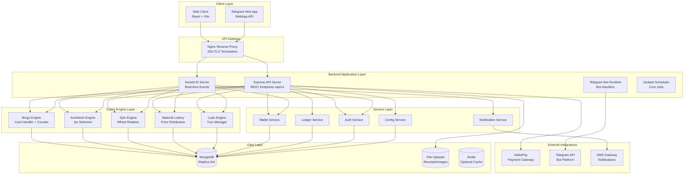
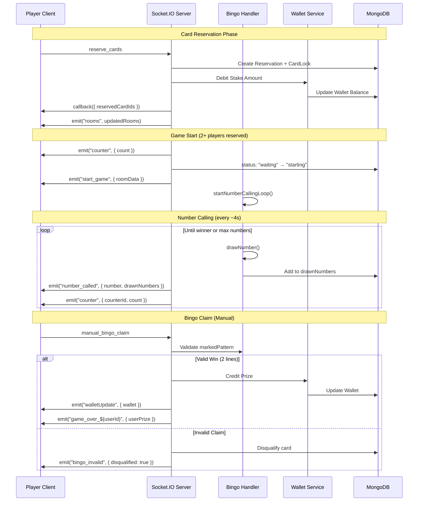
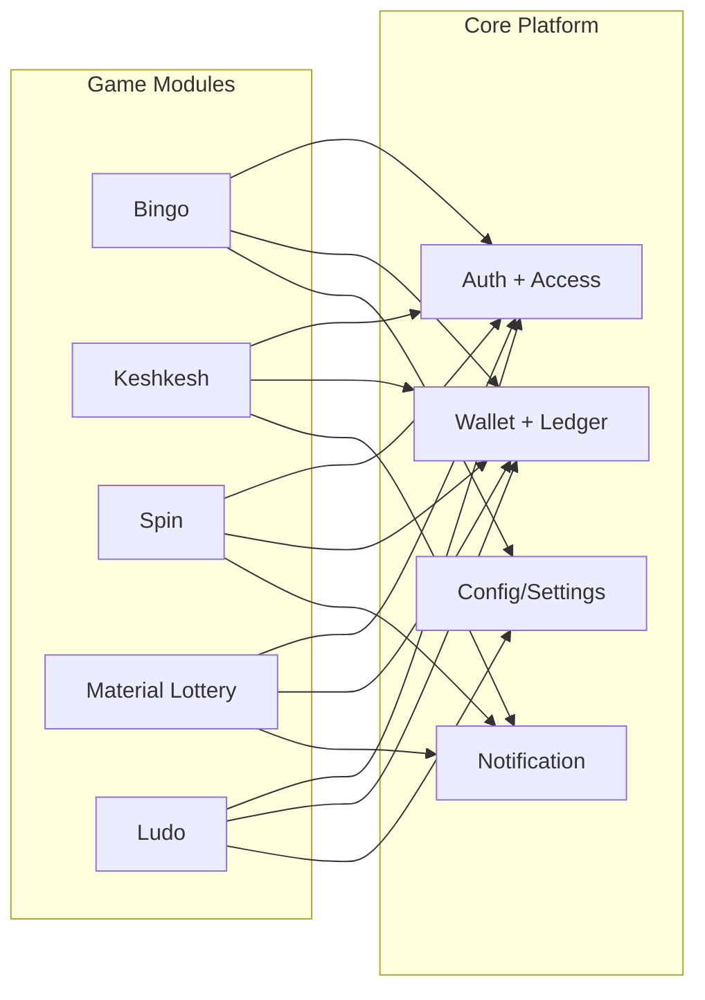
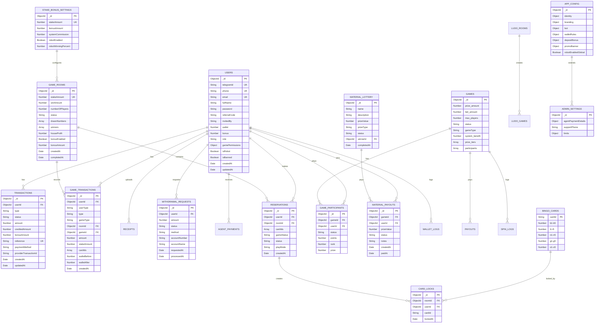
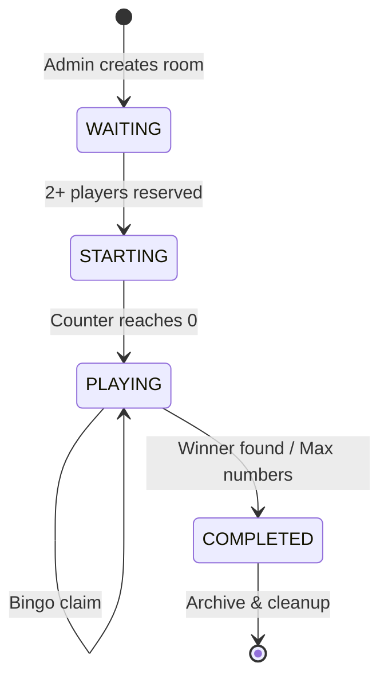

# HAYWIN GAMES - Complete Technical Documentation
## Handover Document for Engineering Team Transition

**Document Version:** 1.0-FINAL  
**Last Updated:** April 17, 2026  
**Author:** Samuel Aberra  
**Email:** samuelabera523@gmail.com  
**Role:** Lead Engineer & Platform Architect (Outgoing)  
**Tenure:** 1 year 7 months at Abyssinia Software Technology  
**Classification:** INTERNAL - Engineering Handover  
**Delivery Status:** ✅ PRODUCTION READY  

---

## Document Sign-Off

| Role | Name | Date | Status |
|------|------|------|--------|
| Lead Engineer | Samuel Aberra | April 17, 2026 | ✅ Complete |
| Engineering Manager | [To be filled] | [Date] | ⬜ Review Pending |
| DevOps Lead | [To be filled] | [Date] | ⬜ Review Pending |
| Security Lead | [To be filled] | [Date] | ⬜ Review Pending |

---

## Contact Information

**Primary Contact:** Samuel Aberra (samuelabera523@gmail.com)  
**Availability:** Open for freelance/part-time consultation post-handover  
**Response Time:** 24-48 hours for critical issues during transition period  

---

## Table of Contents

1. [Executive Overview](#1-executive-overview)
2. [System Architecture](#2-system-architecture)
3. [Tech Stack](#3-tech-stack)
4. [Platform Architecture](#4-platform-architecture-critical)
5. [Project Structure](#5-project-structure)
6. [Database Design](#6-database-design)
7. [API Documentation](#7-api-documentation)
8. [Game Engine & Logic](#8-game-engine--logic-critical)
   - 8.1 Bingo Game Logic
   - 8.2 Keshkesh Game Logic
   - 8.3 Spin Game Logic
   - 8.4 Material Lottery Logic
   - 8.5 Ludo Game Logic
9. [Frontend Architecture](#9-frontend-architecture)
10. [Authentication & Authorization](#10-authentication--authorization)
11. [Wallet & Transaction System](#11-wallet--transaction-system-critical)
12. [Setup & Installation](#12-setup--installation)
13. [Testing Strategy](#13-testing-strategy)
14. [Deployment Guide](#14-deployment-guide)
15. [Monitoring & Logging](#15-monitoring--logging)
16. [Handover Notes](#16-handover-notes-critical)
17. [Future Improvements](#17-future-improvements)
18. [Operational Runbooks](#18-operational-runbooks)
19. [Ownership Matrix](#19-ownership-matrix)

---

## 1. Executive Overview

### 1.1 What is Haywin Games?

Haywin Games is a **comprehensive multi-game gaming platform** built for the Ethiopian market. Unlike single-game applications, it provides a unified ecosystem where players can access multiple games through a single account and wallet.

**Platform Capabilities:**
- **Unified User Account System:** Single registration, login, and profile across all games
- **Shared Wallet & Financial Operations:** One balance for all game participation
- **Comprehensive Admin/Operations Tooling:** Role-based admin panel for all games
- **Game-Specific Runtime Modules:** Optimized engines for each game type
- **Telegram Integration:** Full bot support and mini-app compatibility
- **Real-time & Turn-based Gaming:** Supports both live multiplayer and scheduled games

### 1.2 Current Game Modules

| Game | Type | Status | Description |
|------|------|--------|-------------|
| **Bingo** | Real-time | Production | 5x75 number calling with card reservation |
| **Keshkesh** | Near Real-time | Production | Number selection lottery with jar mechanics |
| **Spin (Fetan)** | Instant | Production | Virtual wheel spin with immediate results |
| **Material Lottery** | Scheduled | Production | Physical prize lottery system |
| **Ludo** | Real-time | Production | Classic board game with betting |

### 1.3 Core Business Model

**Revenue Flow Architecture:**
```
┌─────────────┐    Stake/Play    ┌─────────────┐    Win/Loss    ┌─────────────┐
│ User Wallet │ ────────────────→│  Game Pool  │ ─────────────→│   Winner    │
│             │                  │             │               │   Payout    │
└─────────────┘                  └─────────────┘               └──────┬──────┘
       │                                                              │
       │                                                              │
       │                    Platform Commission                        │
       │◄──────────────────────────────────────────────────────────────┘
       │                         (System Benefit)
       ▼
┌─────────────┐
│  Platform   │
│   Revenue   │
└─────────────┘
```

**Revenue Sources:**
1. **House/System Commission:** Configurable percentage deducted from each game pool
2. **Stake-Pool Margin:** Difference between total stakes and total payouts
3. **Payment Processing:** Fees from deposit/withdrawal transactions

**Stake System (Bingo Example):**
- Players purchase cards at specific stake levels (5, 10, 20, 50, 100 ETB)
- Each card costs exactly one stake amount
- System commission is configurable per stake level via `StakeBonusSettings`
- Commission rate typically 10-15% depending on stake tier

**Win Distribution:**
- Winner receives: `Total Pool × (1 - System Commission)`
- If multiple winners: Prize is split equally among all winners
- House profit = Total Stakes - Winner Payouts - Operational Costs

### 1.4 Target Operating Roles & Permissions

**Role Hierarchy (from `server/models/userModels.js`):**

| Role | Permissions | Description |
|------|-------------|-------------|
| **user** | Play games, deposit, withdraw | Standard registered player |
| **guest** | Limited play, no withdrawals | Temporary/unregistered user |
| **agent** | Limited admin access, user management | Support/moderation role |
| **game_manager** | Game-specific controls | Can manage specific game rooms |
| **admin** | Full system access | System administrators |
| **manager** | Operational oversight | Day-to-day operations |
| **finance** | Payment and withdrawal approval | Financial operations |
| **secretary** | Reporting and documentation | Administrative support |
| **robot** | Automated gameplay | System bots for game filling |

**Per-Game Permission Toggles:**
```javascript
user.gamePermissions = {
  bingo: true,
  keshkesh: true,
  spin: true,
  material_lottery: false,  // Disabled for this user
  ludo: true
}
```

### 1.5 Platform Scope & Extensibility

**Current Capabilities:**
- Real-time game engines (Socket.IO-based): Bingo, Ludo
- Near real-time modules: Keshkesh, Spin, Material Lottery
- Shared payment and wallet infrastructure
- Comprehensive admin dashboard
- Telegram bot integration
- Jackpot system with daily allocations

**Planned-Friendly Architecture:**
- Plugin-like game registration system
- Standardized route/socket/settlement contracts
- Ready for additional verticals:
  - Lottery variants (traditional, instant)
  - Card games (poker, blackjack variants)
  - Sports prediction games
  - Turn-based strategy games

### 1.6 Key Features Matrix

| Feature | Bingo | Keshkesh | Spin | Material Lottery | Ludo |
|---------|-------|----------|------|------------------|------|
| Real-time Play | ✅ | ⚡ | ⚡ | ❌ | ✅ |
| Card/Ticket System | ✅ | ❌ | ❌ | ✅ | ❌ |
| Bot Players | ✅ | ✅ | ✅ | ✅ | ✅ |
| Multiple Winners | ✅ | ❌ | ❌ | ❌ | ❌ |
| Turn-based | ❌ | ❌ | ❌ | ❌ | ✅ |
| Scheduled Games | ❌ | ❌ | ❌ | ✅ | ❌ |
| Physical Prizes | ❌ | ❌ | ❌ | ✅ | ❌ |

*✅ Full support | ⚡ Partial/Near real-time | ❌ Not applicable*

---

## 2. System Architecture

### 2.1 High-Level Architecture Diagram



### 2.2 Real-Time Communication Architecture

**Socket.IO Event Flow (Bingo Example):**



### 2.3 Data Flow During Live Game

```
┌─────────────────────────────────────────────────────────────┐
│  1. GAME INITIALIZATION                                       │
│     - Admin creates room with stake amount                  │
│     - System waits for minimum 2 players                      │
│     - Counter starts (configurable countdown)                 │
└─────────────────────────────────────────────────────────────┘
                              ↓
┌─────────────────────────────────────────────────────────────┐
│  2. CARD/SEAT RESERVATION                                   │
│     - Players reserve cards (Bingo) or seats (Ludo)         │
│     - Wallet debited for stake amount                       │
│     - GameTransaction created (STAKE type)                  │
│     - Lock prevents double-booking                          │
└─────────────────────────────────────────────────────────────┘
                              ↓
┌─────────────────────────────────────────────────────────────┐
│  3. GAME EXECUTION                                          │
│     - Bingo: Random number generation (1-75)                │
│     - Ludo: Turn-based dice rolling                         │
│     - Keshkesh: Number selection and jar shake              │
│     - Spin: Wheel rotation with RNG                         │
│     - Broadcast state to all connected clients              │
└─────────────────────────────────────────────────────────────┘
                              ↓
┌─────────────────────────────────────────────────────────────┐
│  4. WINNER DETECTION                                        │
│     - Bingo: Two-line pattern validation                    │
│     - Ludo: First player to reach home                      │
│     - Keshkesh/Spin: Highest matching numbers               │
│     - Material Lottery: Random selection from participants  │
└─────────────────────────────────────────────────────────────┘
                              ↓
┌─────────────────────────────────────────────────────────────┐
│  5. SETTLEMENT & COMPLETION                                 │
│     - Prize pool calculated (total stakes - commission)     │
│     - Winnings credited to winner wallets                   │
│     - GameTransaction created (WIN type)                    │
│     - New room/game created for next round                  │
└─────────────────────────────────────────────────────────────┘
```

### 2.4 Runtime Lifecycle

Backend process bootstrap (`server/index.js`):

```javascript
// 1. Environment Validation
validateEnvVariables();

// 2. Database Connection
await connectDatabase();
await syncModelIndexes();

// 3. Express Application Setup
const app = createExpressApp();

// 4. Socket.IO Initialization
const io = initializeSocketIO(server);
registerGameSocketHandlers(io);

// 5. Optional Bot Runtime
if (BOT_ENABLED && BOT_RUN_IN_API) {
  await initializeTelegramBot();
}

// 6. Background Services
startJackpotScheduler();
startBotPacingMonitor();

// 7. Error Handling & Graceful Shutdown
registerGlobalErrorHandlers();
registerShutdownHandlers();

// 8. Start Server
server.listen(PORT, () => {
  logger.info(`Server running on port ${PORT}`);
});
```

### 2.5 Communication Patterns

**Real-time (Socket.IO):**
| Pattern | Use Case | Implementation |
|---------|----------|----------------|
| Emit | Broadcast game state to room | `io.to(roomId).emit("event", data)` |
| Callback | Request-response (reservation) | `socket.emit("event", data, callback)` |
| Private | Personal wallet updates | `io.to(userId).emit("walletUpdate", data)` |
| Broadcast | Global announcements | `io.emit("maintenance_notice", data)` |

**HTTP API:**
| Pattern | Use Case | Example |
|---------|----------|---------|
| RESTful CRUD | Admin operations | `GET /users`, `POST /gamerooms` |
| Webhooks | Payment callbacks | `POST /addis-pay/deposit/success` |
| File Upload | Receipt submission | `POST /manual-payment/receipt` |
| Long Polling | Material lottery updates | Polling until game complete |

### 2.6 Cross-Game Data Flow

**Shared Platform Data:**
```
┌─────────────┐     Auth Token      ┌─────────────┐
│   Login     │ ───────────────────→│  All Games  │
│  (/auth)    │                     │  (Shared)   │
└─────────────┘                     └──────┬──────┘
                                           │
                    ┌──────────────────────┼──────────────────────┐
                    │                      │                      │
                    ▼                      ▼                      ▼
            ┌─────────────┐        ┌─────────────┐        ┌─────────────┐
            │    Bingo    │        │  Keshkesh   │        │    Ludo     │
            │   Engine    │        │   Engine    │        │   Engine    │
            └──────┬──────┘        └──────┬──────┘        └──────┬──────┘
                   │                      │                      │
                   └──────────────────────┼──────────────────────┘
                                          │
                                          ▼
                                   ┌─────────────┐
                                   │Shared Wallet│
                                   │   Service   │
                                   └──────┬──────┘
                                          │
                                          ▼
                                   ┌─────────────┐
                                   │  User.wallet│
                                   │  (MongoDB)  │
                                   └─────────────┘
```

**Financial Reporting Dual Ledger:**
- `Transaction` Collection: External cashflow (deposits, withdrawals, transfers)
- `GameTransaction` Collection: Internal game ledger (stakes, wins, refunds)

**Settlement Flow:**
1. Game engine determines winner(s)
2. Prize calculation: `stake × participants × (1 - commission)`
3. Wallet service credits winners atomically
4. Socket emits `walletUpdate` to user-specific room
5. GameTransaction records written for audit trail

---

## 3. Tech Stack

### 3.1 Frontend Stack

| Layer | Technology | Version | Purpose |
|-------|------------|---------|---------|
| Framework | React | 19.x | UI library with hooks and context |
| Build Tool | Vite | 5.x+ | Fast development server and bundler |
| Styling | TailwindCSS | 3.x+ | Utility-first CSS framework |
| UI Components | Material-UI (MUI) | 5.x+ | Pre-built React components |
| Router | react-router-dom | 6.x+ | Client-side routing |
| State Management | Zustand | 4.x+ | Lightweight global state store |
| Context | React Context API | - | Auth, API, Config providers |
| Data Fetching | TanStack Query (React Query) | 5.x+ | Server state management and caching |
| HTTP Client | Axios | 1.x+ | API request handling with interceptors |
| Real-time | socket.io-client | 4.x+ | WebSocket connection management |
| Forms | React Hook Form | 7.x+ | Form handling with validation |
| Validation | Zod | 3.x+ | Schema validation for forms/API |
| Notifications | Sonner | 1.x+ | Toast notification system |
| Icons | Lucide React | 0.x+ | Icon library |
| Animation | Framer Motion | 11.x+ | UI transitions and animations |

### 3.2 Backend Stack

| Layer | Technology | Version | Purpose |
|-------|------------|---------|---------|
| Runtime | Node.js | 18+ | Server runtime environment |
| Framework | Express | 4.x+ | Web application framework |
| Real-time | Socket.IO | 4.x+ | WebSocket server for live games |
| Database | MongoDB | 6.0+ | Document-oriented database |
| ODM | Mongoose | 8.x+ | MongoDB object modeling |
| Authentication | JWT (jsonwebtoken) | 9.x+ | Token-based authentication |
| Password Hashing | bcryptjs | 2.x+ | Secure password hashing |
| Validation | Joi | 17.x+ | Schema validation |
| Validation | express-validator | 7.x+ | Request validation middleware |
| Logging | Winston | 3.x+ | Structured logging with transports |
| Security | Helmet | 7.x+ | Security headers middleware |
| Security | CORS | 2.x+ | Cross-origin resource sharing |
| Rate Limiting | express-rate-limit | 7.x+ | API rate limiting |
| Payments | AddisPay SDK | 1.x+ | Ethiopian payment gateway integration |
| Telegram Bot | Telegraf | 4.x+ | Telegram bot framework |
| Telegram Bot | node-telegram-bot-api | 0.x+ | Alternative Telegram bot API |
| File Upload | Multer | 1.x+ | Multipart file upload handling |
| Scheduling | node-cron | 3.x+ | Cron job scheduler for jackpot |

### 3.3 Infrastructure & DevOps

| Component | Technology | Version/Purpose |
|-----------|------------|-----------------|
| Containerization | Docker | 24.x+ | Application containerization |
| Orchestration | Docker Compose | 2.x+ | Local multi-container management |
| Web Server | Nginx | 1.24+ | Reverse proxy, SSL termination |
| Process Management | PM2 | 5.x+ | Production process manager |
| Environment | dotenv | 16.x+ | Environment variable management |
| Version Control | Git | 2.x+ | Source code management |

### 3.4 Database & Storage

| Component | Technology | Purpose |
|-----------|------------|---------|
| Primary Database | MongoDB | 6.0+ | Document storage with replica sets |
| ODM | Mongoose | 8.x+ | Schema modeling and validation |
| File Storage | Local Filesystem | Receipt uploads, images |
| Optional Cache | Redis | 7.x+ | Session caching, rate limiting (optional) |

### 3.5 External Services

| Service | Provider | Purpose |
|---------|----------|---------|
| Payment Gateway | AddisPay | Mobile money deposits/withdrawals |
| Bot Platform | Telegram Bot API | User notifications, mini-app |
| SMS Gateway | [Provider] | Transaction notifications |
| Email | [Provider] | Verification and marketing emails |

---

## 4. 🧩 Platform Architecture (CRITICAL)

### 4.1 Multi-Game Support Model

Game modules are integrated through two central extension points:
- `server/routes/index.js` (REST route mounting)
- `server/socketController/socketSetup.js` (socket module initialization)

Current socket module registrations:
- `initializeBingoSocket`
- `initializeKeshKeshSocket`
- `initializeSpinSocket`
- `initializeMaterialLotterySocket`
- `initializeLudoSocket`

### 4.2 Shared Services (Platform Core)

Cross-game platform services:
- Authentication + user identity middleware
- Role and permission authorization middleware
- Wallet + ledger services
- Notification pathways
- Config/settings management
- Upload/static file service

### 4.3 Isolation vs Reuse

**Isolated per game (keep isolated):**
- game state machine
- winner logic
- event names and event payloads
- per-game admin behavior

**Shared platform (must stay centralized):**
- auth and permission policies
- wallet operations and ledger consistency
- payment integration and callbacks
- error/logging contracts

### 4.4 Module Interaction Diagram



### 4.5 How to Add a New Game (Step-by-Step)

1. Define game profile
   - realtime loop / turn-based / instant result
2. Add backend models in `server/models/`
3. Add controller(s) in `server/controllers/`
4. Add route module and mount in `server/routes/index.js`
5. Add socket module and register in `server/socketController/socketSetup.js`
6. Add permission key in user schema and enforce with `restrictAccess`
7. Integrate wallet debit/credit with session-based consistency
8. Add `GameTransaction` writes for stake/win/refund
9. Add frontend route + pages + socket hooks
10. Add Postman folder + documentation updates
11. Release with smoke tests and rollback plan

---

## 5. 📁 Project Structure

### 5.1 Root Layout

```text
client/               React frontend
server/               API + sockets + services
docs/                 Handover and Postman docs
docker-compose.yml    Container orchestration baseline
```

### 5.2 Backend Structure

- `server/index.js`: app bootstrap and shutdown
- `server/appSetup.js`: express middleware + route registration
- `server/routes/`: API surface modules
- `server/socketController/`: real-time game modules
- `server/models/`: mongoose schemas
- `server/services/`: wallet, scheduler, game service utilities
- `server/middlewares/`: auth, access, validation, error handling

### 5.3 Frontend Structure

- `client/src/routes/`: route definitions and guards
- `client/src/pages/`: game and admin pages
- `client/src/components/`: shared components and game widgets
- `client/src/contexts/`: auth/api/config providers
- `client/src/services/`: API clients

### 5.4 Naming and Organization Notes

- API prefix standardized at `/api/v1`
- Socket event naming is currently mixed by module; future standardization recommended

---

## 6. Database Design

### 6.1 Entity Relationship Diagram



### 6.2 Core Collections Schema Definitions

#### Users Collection
```javascript
{
  _id: ObjectId,                    // Primary key
  telegramId: String,               // Unique, indexed
  phone: String,                    // Unique, indexed, required
  email: String,                    // Optional, unique
  fullName: String,                 // Required
  password: String,                 // Bcrypt hashed
  referralCode: String,             // Auto-generated
  invitedBy: String,                // Referrer's code
  wallet: Number,                   // Default: 0, non-negative for real users
  bonus: Number,                    // Default: 0
  language: String,                 // Default: "en"
  country: String,                  // Default: "ET"
  role: String,                     // Enum: user, guest, agent, game_manager, admin, manager, finance, secretary, robot
  gamePermissions: {
    bingo: Boolean,                 // Default: true
    keshkesh: Boolean,            // Default: true
    spin: Boolean,                // Default: true
    material_lottery: Boolean,    // Default: false
    ludo: Boolean                 // Default: true
  },
  isRobot: Boolean,                 // Default: false
  isBanned: Boolean,                // Default: false
  banReason: String,
  bannedAt: Date,
  lastLoginAt: Date,
  createdAt: Date,
  updatedAt: Date
}
```

**Important Indexes:**
```javascript
// Unique indexes
{ telegramId: 1 }, { unique: true, sparse: true }
{ phone: 1 }, { unique: true }
{ email: 1 }, { unique: true, sparse: true }
{ referralCode: 1 }, { unique: true, sparse: true }

// Query indexes
{ role: 1, createdAt: -1 }
{ isBanned: 1, createdAt: -1 }
{ isRobot: 1, createdAt: -1 }
```

#### Transaction Collection (Cashflow)
```javascript
{
  _id: ObjectId,
  userId: ObjectId,                 // Ref: Users, indexed
  type: String,                     // Enum: deposit, withdrawal, transfer, registration_bonus, referral_bonus, game_bonus, manual_adjustment
  status: String,                   // Enum: PENDING, COMPLETED, FAILED, CANCELLED
  amount: Number,                   // Transaction amount
  creditedAmount: Number,             // Amount actually credited (after fees)
  bonusAmount: Number,                // Bonus added
  currency: String,                   // Default: "ETB"
  reference: String,                // Unique transaction reference
  paymentMethod: String,            // telebirr, cbe_birr, dashen, abyssinia, manual
  providerTransactionId: String,      // AddisPay or provider transaction ID
  addispayNonce: String,            // AddisPay nonce for verification
  description: String,
  metadata: Object,                   // Additional provider data
  processedBy: ObjectId,              // Admin who processed (for manual)
  processedAt: Date,
  createdAt: Date,
  updatedAt: Date
}
```

**Unique Constraints:**
```javascript
{ reference: 1 }, { unique: true }
{ providerTransactionId: 1 }, { unique: true, sparse: true }
```

#### GameTransaction Collection (Game Ledger)
```javascript
{
  _id: ObjectId,
  userId: ObjectId,                 // Ref: Users, required, indexed
  userType: String,                 // Enum: user, robot
  type: String,                     // Enum: stake, win, refund
  gameType: String,                 // Enum: bingo, keshkesh, spin, material_lottery, ludo
  roomId: ObjectId,                 // Ref: GameRoom (for bingo)
  gameId: ObjectId,                 // Ref: Game (for keshkesh/spin)
  amount: Number,                   // Transaction amount
  stakeAmount: Number,                // Original stake level
  cardIds: [String],                // Cards involved (bingo)
  walletBefore: Number,             // Balance before transaction
  walletAfter: Number,              // Balance after transaction
  description: String,
  metadata: Object,                   // Game-specific data
  createdAt: Date,
  updatedAt: Date
}
```

**Compound Indexes:**
```javascript
{ userId: 1, createdAt: -1 }        // User transaction history
{ gameType: 1, type: 1, createdAt: -1 }  // Game revenue reporting
{ roomId: 1, type: 1 }              // Room settlement verification
{ userType: 1, type: 1, createdAt: -1 }  // Robot vs human analytics
```

#### GameRoom Collection (Bingo)
```javascript
{
  _id: ObjectId,
  stakeAmount: Number,              // Required, indexed
  winAmount: Number,                // Calculated prize pool
  numberOfPlayers: Number,          // Current player count
  maxCardsPerUser: Number,          // Configurable limit
  status: String,                   // Enum: waiting, starting, playing, completed
  createdBy: ObjectId,              // Admin who created
  createdAt: Date,
  drawnNumbers: [Number],           // Called numbers (1-75)
  winners: [{
    userId: ObjectId,
    cardId: String,
    prize: Number,
    winningPattern: [Object]
  }],
  houseProfit: Number,              // Platform earnings
  completedAt: Date,
  bonusEnabled: Boolean,
  bonusAmount: Number,
  bonusDescription: String,
  counterStartedAt: Date,
  counterDuration: Number           // Seconds
}
```

**Critical Index:**
```javascript
// Only one active room per stake amount
gameRoomSchema.index(
  { stakeAmount: 1 },
  {
    unique: true,
    partialFilterExpression: {
      status: { $in: ["waiting", "starting", "playing"] }
    }
  }
);
```

#### Reservation Collection (Bingo Card Reservations)
```javascript
{
  _id: ObjectId,
  userId: ObjectId,                 // Ref: Users, required
  roomId: ObjectId,                 // Ref: GameRoom, required
  cardIds: [{
    cardId: String,
    isDisqualified: Boolean,        // Default: false
    disqualifiedAt: Date,
    disqualificationReason: String
  }],
  gameStatus: String,               // Enum: reserved, playing, won, lost
  status: String,                   // Enum: active, completed, pending, cancelled
  playMode: String,                 // Enum: manual, auto
  totalStake: Number,               // Calculated from card count × stakeAmount
  createdAt: Date,
  updatedAt: Date
}
```

**Critical Index (Prevents Double-Booking):**
```javascript
// Prevents same card being reserved twice in same room
reservationSchema.index(
  { roomId: 1, "cardIds.cardId": 1 },
  {
    unique: true,
    partialFilterExpression: {
      status: { $in: ["active", "pending"] },
      "cardIds.isDisqualified": false
    }
  }
);

// User's active reservations
{ userId: 1, status: 1, createdAt: -1 }
```

#### BingoCard Collection (Pre-generated Cards)
```javascript
{
  cardId: String,                   // Unique, primary key (e.g., "1001")
  // B column (1-15)
  b1: Number, b2: Number, b3: Number, b4: Number, b5: Number,
  // I column (16-30)
  i1: Number, i2: Number, i3: Number, i4: Number, i5: Number,
  // N column (31-45), center is free space (0)
  n1: Number, n2: Number, n3: { type: Number, default: 0 }, n4: Number, n5: Number,
  // G column (46-60)
  g1: Number, g2: Number, g3: Number, g4: Number, g5: Number,
  // O column (61-75)
  o1: Number, o2: Number, o3: Number, o4: Number, o5: Number,
  createdAt: Date
}
```

**Number Ranges:**
- B: 1-15
- I: 16-30
- N: 31-45 (center n3 = 0 is "FREE")
- G: 46-60
- O: 61-75

#### CardLock Collection (Atomic Reservation Locking)
```javascript
{
  _id: ObjectId,
  roomId: ObjectId,                 // Ref: GameRoom
  userId: ObjectId,                 // Ref: Users
  reservationId: ObjectId,          // Ref: Reservation
  cardId: String,                   // The locked card
  lockedAt: Date,
  expiresAt: Date                   // Optional: auto-expire
}
```

**Unique Index:**
```javascript
// One lock per card per room (prevents double reservation)
{ roomId: 1, cardId: 1 }, { unique: true }
```

#### Game Collection (Keshkesh/Spin/Material Lottery)
```javascript
{
  _id: ObjectId,
  name: String,
  description: String,
  gameType: String,                 // keshkesh, spin, material_lottery
  status: String,                   // Enum: pending, active, completed, cancelled
  bet_amount: Number,               // Entry fee per player
  prize_amount: Number,             // Total prize pool
  max_players: Number,              // Maximum participants
  current_players: Number,          // Current participant count
  system_benefit: Number,         // Platform commission rate
  startTime: Date,                  // Scheduled start (for lottery)
  endTime: Date,                    // Scheduled end
  prizeType: String,                // money, material, mixed
  materialPrize: {
    name: String,
    description: String,
    value: Number,
    imageUrl: String
  },
  prize_tiers: [{
    rank: Number,
    prize: Number,
    description: String
  }],
  participants: [{
    userId: ObjectId,
    joinedAt: Date,
    selectedNumbers: [Number],    // For keshkesh
    spinResult: Number,             // For spin
    rank: Number,
    prize: Number,
    status: String                  // pending, winner, loser
  }],
  winnerIds: [ObjectId],            // Winner user IDs
  createdAt: Date,
  completedAt: Date
}
```

#### Withdrawal Collection
```javascript
{
  _id: ObjectId,
  userId: ObjectId,                 // Ref: Users
  amount: Number,                   // Requested amount
  status: String,                   // Enum: pending, approved, rejected, processing, completed
  method: String,                   // telebirr, cbe_birr, dashen, abyssinia
  paymentMethodId: ObjectId,        // Ref: PaymentMethod
  accountNumber: String,            // Phone/account number
  accountName: String,              // Account holder name
  transactionReference: String,     // External transaction ID
  adminNotes: String,
  processedBy: ObjectId,            // Admin who processed
  requestedAt: Date,
  processedAt: Date,
  completedAt: Date,
  createdAt: Date,
  updatedAt: Date
}
```

#### StakeBonusSettings Collection
```javascript
{
  _id: ObjectId,
  stakeAmount: Number,              // Unique: 5, 10, 20, 50, 100, etc.
  bonusAmount: Number,              // Bonus awarded for this stake
  systemCommission: Number,         // Commission rate (0.1 = 10%)
  enabled: Boolean,                 // Is this stake level active?
  robotEnabled: Boolean,            // Allow robots at this stake?
  robotWinningPercent: Number,      // Robot win probability
  maxCardsPerUser: Number,          // Card limit for this stake
  description: String,
  createdAt: Date,
  updatedAt: Date
}
```

**Unique Index:**
```javascript
{ stakeAmount: 1 }, { unique: true }
```

#### AppConfig Collection (Platform Settings)
```javascript
{
  _id: ObjectId,
  identity: {
    appName: String,
    supportPhone: String,
    supportEmail: String,
    termsUrl: String,
    privacyUrl: String
  },
  branding: {
    logoUrl: String,
    faviconUrl: String,
    primaryColor: String,
    secondaryColor: String
  },
  bot: {
    enabled: Boolean,
    autoReplyEnabled: Boolean,
    welcomeMessage: String
  },
  walletRules: {
    minDeposit: Number,
    maxDeposit: Number,
    minWithdrawal: Number,
    maxWithdrawal: Number,
    withdrawalFee: Number
  },
  depositBonus: {
    enabled: Boolean,
    percentage: Number,
    maxAmount: Number
  },
  promoBanner: {
    enabled: Boolean,
    imageUrl: String,
    linkUrl: String,
    startDate: Date,
    endDate: Date
  },
  features: {
    bingo: Boolean,
    keshkesh: Boolean,
    spin: Boolean,
    materialLottery: Boolean,
    ludo: Boolean,
    jackpot: Boolean
  },
  robotEnabledGlobal: Boolean,      // Master switch for all robots
  updatedAt: Date
}
```

### 6.3 Indexing Strategy & Performance

| Collection | Index | Purpose |
|------------|-------|---------|
| Users | `{ telegramId: 1 }` (unique) | Fast login lookup |
| Users | `{ phone: 1 }` (unique) | Phone authentication |
| Users | `{ referralCode: 1 }` (unique) | Referral lookups |
| GameRoom | `{ stakeAmount: 1 }` (unique, partial) | Prevent duplicate active rooms |
| Reservation | `{ userId: 1, roomId: 1 }` | User's active reservations |
| Reservation | `{ roomId: 1, "cardIds.cardId": 1 }` (unique, partial) | Prevent double-booking |
| CardLock | `{ roomId: 1, cardId: 1 }` (unique) | Atomic card locking |
| GameTransaction | `{ userId: 1, createdAt: -1 }` | User transaction history |
| GameTransaction | `{ gameType: 1, type: 1, createdAt: -1 }` | Revenue reporting |
| Transaction | `{ reference: 1 }` (unique) | Prevent duplicate transactions |
| Transaction | `{ providerTransactionId: 1 }` (unique, sparse) | Provider reconciliation |
| Withdrawal | `{ userId: 1, status: 1, requestedAt: -1 }` | User withdrawal history |
| Game | `{ status: 1, startTime: 1 }` | Scheduled game queries |
| MaterialLottery | `{ status: 1, createdAt: -1 }` | Active lotteries |

### 6.4 Architecture Patterns & Data Flow

**1. Dual Ledger Pattern**

```
┌─────────────────────────────────────────────────────────────┐
│                    TRANSACTION (Cashflow)                   │
├─────────────────────────────────────────────────────────────┤
│ • External payment processing                               │
│ • Deposits, withdrawals, transfers                          │
│ • Bonus and referral credits                                │
│ • Provider integration fields                               │
│ • Immutable financial record                                │
└─────────────────────────────────────────────────────────────┘
                              ↕
┌─────────────────────────────────────────────────────────────┐
│                GAME_TRANSACTION (Game Ledger)                 │
├─────────────────────────────────────────────────────────────┤
│ • In-game financial movements                               │
│ • Stakes, wins, refunds                                     │
│ • Revenue calculation source                                │
│ • Wallet tracking (before/after)                          │
│ • Game type context (bingo/keshkesh/lottery)              │
└─────────────────────────────────────────────────────────────┘
```

**2. State Machine Pattern (GameRoom)**

```
┌──────────┐    2+ players      ┌───────────┐    countdown    ┌──────────┐
│ WAITING  │ ──────────────────→ │ STARTING  │ ───────────────→ │ PLAYING  │
│  (new)   │      reserve        │ (locked)  │   reaches 0     │ (active) │
└──────────┘                     └───────────┘                 └────┬─────┘
                                                                    │
                            ┌───────────────────────────────────────┘
                            │  winner found
                            ▼
                     ┌──────────────┐
                     │  COMPLETED   │
                     │  (archived)  │
                     └──────────────┘
```

**3. Optimistic Locking with CardLock**

Prevents race conditions during card reservation:

```javascript
// Flow:
// 1. Try to create CardLock (fails if exists)
// 2. On success, proceed with reservation
// 3. On failure, card already reserved by another user

const lockCard = async (roomId, cardId, userId) => {
  try {
    const lock = await CardLock.create({
      roomId,
      cardId,
      userId,
      lockedAt: new Date()
    });
    return { success: true, lock };
  } catch (error) {
    if (error.code === 11000) { // Duplicate key
      return { success: false, error: "Card already reserved" };
    }
    throw error;
  }
};
```

**4. Financial Integrity Constraints**

```javascript
// Wallet cannot go negative for real users
wallet: {
  type: Number,
  default: 0,
  validate: {
    validator: function(v) {
      if (this.role === "robot" || this.isRobot) return true;
      return v >= 0;
    },
    message: "Wallet balance cannot be negative for regular users"
  }
}

// Transaction reference must be unique
reference: { type: String, required: true, unique: true }
```

---

## 7. API Documentation

### 7.1 Base URL & Authentication

**Development:** `http://localhost:5000/api/v1`  
**Production:** `https://api.haywingames.com/api/v1`

**Health Check:** `GET /api/v1/health`

**Authentication:**
- Type: JWT Bearer Token
- Header: `Authorization: Bearer <token>`
- Token Source: Login endpoint or Telegram auth

### 7.2 Authentication Endpoints

#### POST /auth/register
Register new user account.

**Request:**
```json
{
  "fullName": "John Doe",
  "phone": "+251911234567",
  "password": "StrongPassword123",
  "referralCode": ""
}
```

**Response:**
```json
{
  "success": true,
  "token": "eyJhbGciOiJIUzI1NiIsInR5cCI6IkpXVCJ9...",
  "user": {
    "_id": "507f1f77bcf86cd799439011",
    "fullName": "John Doe",
    "phone": "+251911234567",
    "wallet": 0,
    "bonus": 0,
    "role": "user"
  }
}
```

#### POST /auth/login
Login with phone/password.

**Request:**
```json
{
  "phone": "+251911234567",
  "password": "StrongPassword123"
}
```

**Response:**
```json
{
  "success": true,
  "token": "eyJhbGciOiJIUzI1NiIsInR5cCI6IkpXVCJ9...",
  "user": {
    "_id": "507f1f77bcf86cd799439011",
    "fullName": "John Doe",
    "phone": "+251911234567",
    "wallet": 1500,
    "bonus": 200,
    "role": "user",
    "gamePermissions": {
      "bingo": true,
      "keshkesh": true,
      "spin": true,
      "material_lottery": false,
      "ludo": true
    }
  }
}
```

#### POST /auth/telegram
Telegram Mini-App authentication via initData.

**Request:**
```json
{
  "initData": "query_id=...&user=...&auth_date=...&hash=..."
}
```

#### GET /auth/profile
Get current user profile (requires auth).

**Response:**
```json
{
  "success": true,
  "user": {
    "_id": "507f1f77bcf86cd799439011",
    "fullName": "John Doe",
    "phone": "+251911234567",
    "wallet": 1500,
    "bonus": 200,
    "referralCode": "ABC123",
    "invitedBy": "",
    "role": "user",
    "gamePermissions": {...}
  }
}
```

### 7.3 Game Room Endpoints (Bingo)

#### GET /gamerooms
Get all game rooms with current status.

**Response:**
```json
{
  "success": true,
  "rooms": [
    {
      "_id": "507f1f77bcf86cd799439012",
      "stakeAmount": 50,
      "winAmount": 450,
      "numberOfPlayers": 12,
      "status": "playing",
      "bonusEnabled": true,
      "bonusAmount": 100,
      "drawnNumbers": [1, 15, 23, 34, 52, 61, 75],
      "createdAt": "2026-04-17T08:00:00Z"
    }
  ]
}
```

#### GET /gamerooms/:id
Get specific game room by ID.

**Response:**
```json
{
  "success": true,
  "room": {
    "_id": "507f1f77bcf86cd799439012",
    "stakeAmount": 50,
    "status": "playing",
    "drawnNumbers": [1, 15, 23, 34, 52, 61, 75],
    "winners": [],
    "numberOfPlayers": 12
  }
}
```

#### POST /gamerooms
Create new game room (Admin only).

**Request:**
```json
{
  "stakeAmount": 100,
  "bonusEnabled": true,
  "bonusAmount": 50,
  "maxCardsPerUser": 10
}
```

**Response:**
```json
{
  "success": true,
  "room": {
    "_id": "507f1f77bcf86cd799439013",
    "stakeAmount": 100,
    "status": "waiting",
    "createdAt": "2026-04-17T08:00:00Z"
  }
}
```

### 7.4 Wallet & Transaction Endpoints

#### GET /users/balance/:telegramId
Get user wallet balance by Telegram ID.

**Response:**
```json
{
  "wallet": 1500,
  "bonus": 200
}
```

#### GET /transactions/mine
Get current user's transaction history.

**Query Parameters:**
- `type`: deposit|withdrawal|transfer|registration_bonus|referral_bonus|game_bonus
- `status`: PENDING|COMPLETED|FAILED|CANCELLED
- `page`: Page number (default: 1)
- `limit`: Items per page (default: 20)

**Response:**
```json
{
  "success": true,
  "transactions": [
    {
      "_id": "507f1f77bcf86cd799439014",
      "type": "deposit",
      "status": "COMPLETED",
      "amount": 100,
      "creditedAmount": 100,
      "bonusAmount": 20,
      "reference": "txn_123456789",
      "paymentMethod": "telebirr",
      "createdAt": "2026-04-15T08:30:00Z"
    }
  ],
  "pagination": {
    "page": 1,
    "limit": 20,
    "total": 45,
    "totalPages": 3
  }
}
```

#### GET /transactions/bonuses
Get current user's bonus transaction history.

### 7.5 Payment Endpoints

#### POST /addis-pay/deposit
Initiate AddisPay deposit.

**Request:**
```json
{
  "amount": 100,
  "paymentMethod": "telebirr"
}
```

**Response:**
```json
{
  "success": true,
  "transaction": {
    "_id": "507f1f77bcf86cd799439015",
    "reference": "DEP123456",
    "status": "PENDING",
    "amount": 100
  },
  "paymentUrl": "https://addispay.com/checkout/..."
}
```

#### POST /manual-payment/receipt
Submit manual receipt for deposit (requires auth + file upload).

**Request (multipart/form-data):**
- `receipt`: File (image)
- `amount`: 100
- `paymentMethod`: telebirr

#### POST /withdrawal/request
Submit withdrawal request.

**Request:**
```json
{
  "amount": 100,
  "paymentMethod": "telebirr",
  "accountDetails": {
    "phone": "+251955667788",
    "name": "John Doe"
  }
}
```

### 7.6 Admin Endpoints

#### GET /admin/dashboard
Get admin dashboard statistics.

**Response:**
```json
{
  "success": true,
  "stats": {
    "totalUsers": 1250,
    "activeUsers": 340,
    "totalGames": 456,
    "todayRevenue": 8500,
    "pendingWithdrawals": 12
  }
}
```

#### GET /users/all
Get all users (Admin only).

**Query Parameters:**
- `role`: Filter by role
- `isBanned`: true|false
- `search`: Search by name/phone

#### PUT /users/:id/role
Update user role (Admin only).

**Request:**
```json
{
  "role": "agent"
}
```

### 7.7 Error Handling Convention

**Standard Error Response:**
```json
{
  "success": false,
  "error": {
    "code": "INSUFFICIENT_FUNDS",
    "message": "Wallet balance is insufficient for this operation",
    "details": {
      "required": 100,
      "available": 50
    }
  },
  "timestamp": "2026-04-17T08:34:00.000Z"
}
```

**Common Error Codes:**
| Code | HTTP Status | Description |
|------|-------------|-------------|
| UNAUTHORIZED | 401 | Invalid or missing token |
| FORBIDDEN | 403 | Insufficient permissions |
| NOT_FOUND | 404 | Resource not found |
| VALIDATION_ERROR | 400 | Invalid request data |
| INSUFFICIENT_FUNDS | 400 | Wallet balance too low |
| DUPLICATE_ENTRY | 409 | Resource already exists |
| RATE_LIMITED | 429 | Too many requests |
| INTERNAL_ERROR | 500 | Server error |

### 7.8 Complete Route Inventory

**Platform Routes:**
| Method | Endpoint | Auth | Description |
|--------|----------|------|-------------|
| POST | /auth/register | No | User registration |
| POST | /auth/login | No | User login |
| POST | /auth/telegram | No | Telegram auth |
| GET | /auth/profile | Yes | Get profile |
| PUT | /auth/profile | Yes | Update profile |
| POST | /auth/change-password | Yes | Change password |
| GET | /users/all | Admin | List all users |
| GET | /users/:id | Yes | Get user by ID |
| PUT | /users/:id/role | Admin | Update user role |
| PUT | /users/:id/wallet | Admin | Adjust wallet |
| PUT | /users/:id/ban | Admin | Ban user |
| GET | /transactions | Yes | List transactions |
| GET | /transactions/mine | Yes | My transactions |
| GET | /transactions/bonuses | Yes | Bonus history |
| POST | /addis-pay/deposit | Yes | Initiate deposit |
| POST | /addis-pay/withdraw | Yes | Initiate withdrawal |
| POST | /withdrawal/request | Yes | Request withdrawal |
| GET | /withdrawal/requests | Admin | List withdrawals |
| POST | /withdrawal/approve | Admin | Approve withdrawal |
| POST | /transfer | Yes | Transfer to user |
| GET | /config | Admin | Get app config |
| PUT | /config | Admin | Update config |
| GET | /settings | Yes | Get settings |
| PUT | /settings | Admin | Update settings |

**Bingo Routes:**
| Method | Endpoint | Auth | Description |
|--------|----------|------|-------------|
| GET | /gamerooms | Yes | List all rooms |
| GET | /gamerooms/:id | Yes | Get room details |
| POST | /gamerooms | Admin | Create room |
| PUT | /gamerooms/:id | Admin | Update room |
| DELETE | /gamerooms/:id | Admin | Delete room |
| GET | /bingo-cards | Yes | List cards |
| POST | /bingo-cards/create | Admin | Create cards |
| GET | /bingo-cards/count | Yes | Get card count |
| GET | /bingo/get/:cardId | Yes | Get card by ID |

**Keshkesh Routes:**
| Method | Endpoint | Auth | Description |
|--------|----------|------|-------------|
| GET | /keshkesh | Yes | List games |
| POST | /keshkesh/create | Admin | Create game |
| GET | /keshkesh/:id | Yes | Get game |
| PUT | /keshkesh/:id | Admin | Update game |
| DELETE | /keshkesh/:id | Admin | Delete game |

**Ludo Routes:**
| Method | Endpoint | Auth | Description |
|--------|----------|------|-------------|
| GET | /ludo/rooms | Yes | List rooms |
| POST | /ludo/rooms/create | Yes | Create room |
| POST | /ludo/rooms/join | Yes | Join room |
| GET | /ludo/rooms/:id | Yes | Get room |
| POST | /ludo/rooms/:id/cancel | Admin | Cancel room |
| GET | /ludo/admin/rooms | Admin | Admin list |

### 7.9 Postman Collection

**Complete API Collection:** `docs/HaywinGames.postman.json`
- 196+ pre-configured endpoints
- Environment variables included
- Auto-saving tokens and IDs
- Organized by game and function

**Import Instructions:**
1. Open Postman
2. Click **Import** → Select `docs/HaywinGames.postman.json`
3. Collection and environment auto-imported
4. Set `baseUrl` variable for your environment

**Environment Variables:**
| Variable | Description |
|----------|-------------|
| `baseUrl` | API base URL |
| `token` | JWT token (auto-populated) |
| `userId` | Current user ID (auto-populated) |
| `roomId` | Active room ID |
| `gameId` | Active game ID |
| `cardId` | Test card ID |

---

## 8. Game Engine & Logic (CRITICAL)

### 8.1 Execution Principles

- **Server Authoritative:** All game state decisions made server-side
- **Validation:** Client actions must be validated before processing
- **Transaction Safety:** Wallet and game state changes are atomic
- **Idempotency:** Game completion and payouts can be safely retried
- **Audit Trail:** All financial movements logged in GameTransaction

### 8.2 Generic Game Lifecycle

```
┌─────────────┐     ┌─────────────┐     ┌─────────────┐     ┌─────────────┐     ┌─────────────┐
│Initialize   │────→│Participation│────→│  Execution  │────→│   Winner    │────→│ Settlement  │
│  (Create)   │     │ (Reserve)   │     │  (Gameplay) │     │ (Determine) │     │  (Payout)   │
└─────────────┘     └─────────────┘     └─────────────┘     └─────────────┘     └─────────────┘
```

### 8.3 Socket.IO Event Architecture

**Client → Server Events:**
| Event | Payload | Description |
|-------|---------|-------------|
| `reserve_cards` | `{ roomId, cardIds, userId, playMode }` | Reserve cards for Bingo |
| `get_reserved_cards` | `{ userId, roomId }` | Get user's reserved cards |
| `manual_bingo_claim` | `{ userId, cardId, roomId, markedPattern }` | Submit bingo claim |
| `join_room` | `{ roomId, userId }` | Join game room |
| `update_play_mode` | `{ userId, playMode, roomId }` | Switch manual/auto |
| `update_auth` | `{ userId }` | Update socket auth |
| `get_wallet` | `{ userId }` | Request wallet balance |
| `requestInitialData` | - | Get initial app state |

**Server → Client Events:**
| Event | Payload | Description |
|-------|---------|-------------|
| `start_game` | `{ roomId, drawnNumbers, ... }` | Game started |
| `number_called` | `{ number, drawnNumbers }` | New number drawn |
| `bingo_winner` | `{ userId, cardId, prize }` | Winner announced |
| `bingo_invalid` | `{ message, disqualified }` | Invalid claim response |
| `game_over_${userId}` | `{ roomId, userPrize, ... }` | Game ended (user-specific) |
| `walletUpdate` | `{ wallet }` | Balance changed |
| `rooms` | `[roomsWithBonus]` | Active rooms update |
| `settings` | `{ appSettings }` | Config update |
| `counter` | `{ counterId, count }` | Countdown update |
| `error` | `{ message }` | Error response |

### 8.4 Bingo Game Logic (Detailed)

#### 8.4.1 Game Lifecycle



#### 8.4.2 Number Generation System

**Algorithm:** `server/utils/drawnNumber.js`

```javascript
function drawNumber(drawnNumbers, maxNumber = 75) {
  const availableNumbers = [];
  for (let i = 1; i <= maxNumber; i++) {
    if (!drawnNumbers.includes(i)) {
      availableNumbers.push(i);
    }
  }
  
  if (availableNumbers.length === 0) return null;
  
  const randomIndex = Math.floor(Math.random() * availableNumbers.length);
  return availableNumbers[randomIndex];
}
```

**Number Distribution:**
- **B Column:** 1-15
- **I Column:** 16-30
- **N Column:** 31-45 (center is FREE)
- **G Column:** 46-60
- **O Column:** 61-75

#### 8.4.3 Winning Patterns

**Two-Line Win Detection:**
```javascript
const WINNING_PATTERNS = {
  horizontal: [
    [{r:0,c:0}, {r:0,c:1}, {r:0,c:2}, {r:0,c:3}, {r:0,c:4}],
    [{r:1,c:0}, {r:1,c:1}, {r:1,c:2}, {r:1,c:3}, {r:1,c:4}],
    [{r:2,c:0}, {r:2,c:1}, {r:2,c:2}, {r:2,c:3}, {r:2,c:4}],
    [{r:3,c:0}, {r:3,c:1}, {r:3,c:2}, {r:3,c:3}, {r:3,c:4}],
    [{r:4,c:0}, {r:4,c:1}, {r:4,c:2}, {r:4,c:3}, {r:4,c:4}],
  ],
  vertical: [
    [{r:0,c:0}, {r:1,c:0}, {r:2,c:0}, {r:3,c:0}, {r:4,c:0}],
    [{r:0,c:1}, {r:1,c:1}, {r:2,c:1}, {r:3,c:1}, {r:4,c:1}],
    [{r:0,c:2}, {r:1,c:2}, {r:2,c:2}, {r:3,c:2}, {r:4,c:2}],
    [{r:0,c:3}, {r:1,c:3}, {r:2,c:3}, {r:3,c:3}, {r:4,c:3}],
    [{r:0,c:4}, {r:1,c:4}, {r:2,c:4}, {r:3,c:4}, {r:4,c:4}],
  ],
  diagonal: [
    [{r:0,c:0}, {r:1,c:1}, {r:2,c:2}, {r:3,c:3}, {r:4,c:4}],
    [{r:0,c:4}, {r:1,c:3}, {r:2,c:2}, {r:3,c:1}, {r:4,c:0}],
  ]
};
```

#### 8.4.4 Card Disqualification System

**Purpose:** Prevent cheating by users marking uncalled numbers.

**Disqualification Flow:**
```javascript
socket.on('manual_bingo_claim', async (data) => {
  const { userId, cardId, roomId, markedPattern } = data;
  
  // 1. Get card grid
  const card = await BingoCard.findOne({ cardId });
  
  // 2. Check if marked numbers are valid (all drawn or free)
  const invalidMarks = markedPattern.filter(mp => {
    if (mp.value === "F" || mp.value === 0) return false;
    return !drawnNumbers.includes(mp.value);
  });
  
  if (invalidMarks.length > 0) {
    // DISQUALIFY
    await disqualifyCard(userId, cardId, roomId, 
      `Marked uncalled numbers: ${invalidMarks.map(m => m.value).join(', ')}`);
    
    socket.emit('bingo_invalid', {
      message: `Marked uncalled numbers`,
      disqualified: true,
      cards: [cardId]
    });
    return;
  }
  
  // 3. Check 2-line pattern
  const hasTwoLines = checkSpecificMarkedPattern(markedPattern, "two_line");
  
  if (!hasTwoLines) {
    socket.emit('bingo_invalid', {
      message: 'Pattern does not form 2 complete lines',
      disqualified: false
    });
    return;
  }
  
  // 4. Valid claim - process win
  await processWin(userId, cardId, roomId);
});
```

#### 8.4.5 Prize Distribution

**Calculation:**
```javascript
function calculatePrize(room, winnerCount) {
  const totalStake = room.stakeAmount * room.reservedCards.length;
  const systemCommission = totalStake * room.commissionRate;
  const prizePool = totalStake - systemCommission;
  
  const prizePerWinner = prizePool / winnerCount;
  
  return {
    totalStake,
    systemCommission,
    prizePool,
    prizePerWinner,
    winnerCount
  };
}
```

### 8.5 Keshkesh Game Logic

#### 8.5.1 Game Flow

1. **Game Creation:** Admin creates game with bet amount and max players
2. **Number Selection:** Each player selects 2 numbers (1-100)
3. **Jar Shake:** Random numbers drawn until winner determined
4. **Winner Selection:** Player with most matching numbers wins

#### 8.5.2 Winner Determination

```javascript
function determineKeshkeshWinners(participants, drawnNumbers) {
  // Score each participant
  const scoredParticipants = participants.map(p => {
    const matches = p.selectedNumbers.filter(n => 
      drawnNumbers.includes(n)
    ).length;
    return { ...p, matches };
  });
  
  // Sort by matches descending
  scoredParticipants.sort((a, b) => b.matches - a.matches);
  
  // Highest match count is winner
  const maxMatches = scoredParticipants[0].matches;
  const winners = scoredParticipants.filter(p => p.matches === maxMatches);
  
  return winners;
}
```

### 8.6 Spin (Fetan) Game Logic

#### 8.6.1 Game Mechanics

1. **Wheel Segments:** 8-12 segments with different multipliers
2. **Player Participation:** Players bet before spin
3. **RNG Spin:** Server determines result using `crypto.randomInt`
4. **Payout:** Bet × Multiplier for winning segment

#### 8.6.2 RNG Implementation

```javascript
const crypto = require('crypto');

function spinWheel(segments) {
  const index = crypto.randomInt(0, segments.length);
  return {
    segment: segments[index],
    index,
    multiplier: segments[index].multiplier
  };
}
```

### 8.7 Material Lottery Logic

#### 8.7.1 Game Structure

1. **Prize Definition:** Physical or monetary prize
2. **Participation:** Users buy tickets for entry
3. **Scheduled Draw:** Winner selected at scheduled time
4. **Prize Delivery:** Physical prize requires manual fulfillment

#### 8.7.2 Winner Selection

```javascript
function selectLotteryWinner(participants) {
  const totalTickets = participants.reduce((sum, p) => sum + p.ticketCount, 0);
  const winningTicket = crypto.randomInt(1, totalTickets + 1);
  
  let currentTicket = 0;
  for (const participant of participants) {
    currentTicket += participant.ticketCount;
    if (currentTicket >= winningTicket) {
      return participant.userId;
    }
  }
}
```

### 8.8 Ludo Game Logic

#### 8.8.1 Game Flow

1. **Room Creation:** Player creates room with stake amount
2. **Join:** Other players join (2-4 players)
3. **Turn-based Play:** Dice rolls determine movement
4. **Winning:** First player to get all pieces home wins

#### 8.8.2 Turn Management

```javascript
function nextTurn(room) {
  const currentIndex = room.players.findIndex(p => p.id === room.currentTurn);
  const nextIndex = (currentIndex + 1) % room.players.length;
  
  room.currentTurn = room.players[nextIndex].id;
  room.turnStartedAt = new Date();
  room.turnTimeout = setTimeout(() => handleTurnTimeout(room), 30000);
  
  io.to(room.id).emit('turn_changed', {
    playerId: room.currentTurn,
    timeout: 30000
  });
}
```

### 8.9 RNG and Fairness

**Current Implementation:**
- `crypto.randomInt()` for cryptographically secure randomness
- No seed-based reproducibility (truly random)
- Server-side only (never client-side)

**Recommended Enhancements:**
```javascript
// Provable fairness with commit-reveal
function generateFairRandom(seed, nonce) {
  const hash = crypto.createHash('sha256')
    .update(`${seed}-${nonce}`)
    .digest('hex');
  return parseInt(hash.slice(0, 8), 16);
}
```

### 8.10 Result Validation

**Post-Game Verification:**
1. Recompute expected prize from stakes
2. Verify wallet movements match calculated prizes
3. Check GameTransaction records consistency
4. Flag discrepancies for manual review

```javascript
async function validateGameSettlement(roomId) {
  const game = await GameRoom.findById(roomId);
  const transactions = await GameTransaction.find({ roomId });
  
  const expectedPayout = calculateExpectedPayout(game);
  const actualPayout = transactions
    .filter(t => t.type === 'win')
    .reduce((sum, t) => sum + t.amount, 0);
  
  if (Math.abs(expectedPayout - actualPayout) > 0.01) {
    await alertReconciliationIssue(roomId, expectedPayout, actualPayout);
  }
}
```

---

## 9. 🖥 Frontend Architecture

### 9.1 Multi-Game UI Design

Frontend is modular by game:
- route-driven game entry points
- game-specific room/play views
- permission-gated admin pages

### 9.2 Dynamic Multi-Game Routing

`client/src/routes/AppRoutes.jsx` includes:
- player game routes
- admin game routes by permission
- auth and protected route wrappers

### 9.3 State and API Integration

- Token in Zustand store
- Axios client from `ApiContext` with interceptors
- global 401 handling and user logout
- socket events update UI in near real-time

### 9.4 New Game UI Integration Pattern

1. add route definitions
2. add page folder + room UI + play UI
3. add socket event hooks
4. add admin route/permissions
5. update game center listing

---

## 10. Authentication & Authorization

### 10.1 JWT Token Strategy

**Token Structure:**
```javascript
// JWT Payload
{
  userId: "507f1f77bcf86cd799439011",
  telegramId: "123456789",
  role: "user",
  gamePermissions: ["bingo", "keshkesh", "spin", "ludo"],
  iat: 1713172800,      // Issued at
  exp: 1713259200       // Expires (24 hours)
}
```

**Middleware Implementation:** `server/middlewares/auth.js`
```javascript
const authenticate = async (req, res, next) => {
  try {
    const authHeader = req.headers.authorization;
    const token = authHeader?.split(' ')[1];
    
    if (!token) {
      return res.status(401).json({ 
        success: false, 
        error: { code: 'UNAUTHORIZED', message: 'Authentication required' }
      });
    }
    
    const decoded = jwt.verify(token, process.env.JWT_SECRET);
    
    // Verify user still exists and is active
    const user = await User.findById(decoded.userId);
    if (!user || user.isBanned) {
      return res.status(401).json({ 
        success: false, 
        error: { code: 'UNAUTHORIZED', message: 'User not found or banned' }
      });
    }
    
    req.user = user;
    next();
  } catch (error) {
    return res.status(401).json({ 
      success: false, 
      error: { code: 'UNAUTHORIZED', message: 'Invalid token' }
    });
  }
};

// Role-based authorization
const authorize = (...roles) => {
  return (req, res, next) => {
    if (!roles.includes(req.user.role)) {
      return res.status(403).json({
        success: false,
        error: { code: 'FORBIDDEN', message: 'Insufficient permissions' }
      });
    }
    next();
  };
};
```

### 10.2 Game Permission System

**Permission Middleware:** `server/middlewares/restrictAccess.js`
```javascript
const restrictAccess = (gameType) => {
  return async (req, res, next) => {
    const user = req.user;
    
    // Admin bypass
    if (user.role === 'admin') return next();
    
    // Check game permission
    const hasPermission = user.gamePermissions?.[gameType];
    if (!hasPermission) {
      return res.status(403).json({
        success: false,
        error: { code: 'FORBIDDEN', message: `Access to ${gameType} is disabled` }
      });
    }
    
    next();
  };
};

// Usage
router.post('/gamerooms', authenticate, restrictAccess('bingo'), createRoom);
```

### 10.3 Role-Based Access Control

**Role Hierarchy:**
| Role | Description | Capabilities |
|------|-------------|--------------|
| **admin** | System administrator | Full system access |
| **manager** | Operations manager | Users, games, reports |
| **finance** | Finance officer | Payments, withdrawals |
| **game_manager** | Game moderator | Game rooms, settings |
| **agent** | Support agent | User support, view-only |
| **user** | Standard player | Play games, deposit, withdraw |
| **guest** | Unregistered user | Limited play, no withdrawals |
| **robot** | System bot | Automated gameplay |

**Permission Matrix:**
```javascript
const PERMISSIONS = {
  admin: ['*'],  // All permissions
  manager: [
    'users.read', 'users.update',
    'games.manage', 'reports.read',
    'settings.read'
  ],
  finance: [
    'transactions.read', 'transactions.approve',
    'withdrawals.read', 'withdrawals.approve'
  ],
  game_manager: [
    'gamerooms.create', 'gamerooms.update', 'gamerooms.delete',
    'keshkesh.manage', 'spin.manage', 'ludo.manage'
  ],
  agent: [
    'users.read', 'users.support',
    'transactions.read'
  ],
  user: [
    'profile.read', 'profile.update',
    'games.play', 'wallet.read', 'transactions.create'
  ]
};
```

### 10.4 Rate Limiting

**Configuration:** `server/middlewares/rateLimiter.js`
```javascript
const rateLimit = require('express-rate-limit');

// General API limit
const apiLimiter = rateLimit({
  windowMs: 15 * 60 * 1000,  // 15 minutes
  max: 100,                   // 100 requests per window
  message: { success: false, error: { code: 'RATE_LIMITED', message: 'Too many requests' }}
});

// Strict limit for auth endpoints
const authLimiter = rateLimit({
  windowMs: 15 * 60 * 1000,
  max: 10,
  skipSuccessfulRequests: true
});

// OTP specific limit
const otpLimiter = rateLimit({
  windowMs: 10 * 60 * 1000,   // 10 minutes
  max: 5,
  keyGenerator: (req) => req.body.phone || req.ip
});

// Withdrawal limit
const withdrawalLimiter = rateLimit({
  windowMs: 60 * 60 * 1000,   // 1 hour
  max: 3,
  keyGenerator: (req) => req.user._id.toString()
});
```

### 10.5 Security Best Practices

**Implemented:**
- ✅ JWT with 24-hour expiration
- ✅ Password hashing with bcrypt (salt rounds: 10)
- ✅ Rate limiting on all endpoints
- ✅ Role-based access control
- ✅ Game permission system
- ✅ CORS configuration
- ✅ Helmet security headers
- ✅ Input validation (Joi/Zod)

**Recommended:**
- 🔲 2FA for admin accounts
- 🔲 IP-based blocking for suspicious activity
- 🔲 Session management with refresh tokens
- 🔲 Password complexity requirements
- 🔲 Account lockout after failed attempts

---

## 11. Wallet & Transaction System (CRITICAL)

### 11.1 Wallet Architecture

**Dual Balance System:**
```javascript
user = {
  wallet: Number,      // Primary balance (default: 0)
  bonus: Number        // Bonus balance (default: 0)
}
```

**Balance Rules:**
- **Real Users:** Wallet cannot go negative
- **Robots:** Can have negative balance (system accounts)
- **Bonus:** Can only be used for game stakes, not withdrawable
- **Stake Priority:** Bonus is used first, then wallet

### 11.2 Transaction Domains

**Dual Ledger Pattern:**

```
┌─────────────────────────────────────────────────────────────┐
│                    TRANSACTION (Cashflow)                   │
├─────────────────────────────────────────────────────────────┤
│ Types:                                                      │
│ • deposit (AddisPay, manual receipt)                      │
│ • withdrawal (approved by finance)                        │
│ • transfer (P2P wallet transfer)                        │
│ • registration_bonus (new user reward)                  │
│ • referral_bonus (referrer reward)                        │
│                                                             │
│ Fields:                                                     │
│ • reference (unique transaction ID)                       │
│ • providerTransactionId (AddisPay reference)              │
│ • status: PENDING, COMPLETED, FAILED, CANCELLED           │
└─────────────────────────────────────────────────────────────┘
                              ↕
┌─────────────────────────────────────────────────────────────┐
│                GAME_TRANSACTION (Game Ledger)                 │
├─────────────────────────────────────────────────────────────┤
│ Types:                                                      │
│ • stake (game participation fee)                            │
│ • win (prize payout)                                        │
│ • refund (game cancellation return)                       │
│                                                             │
│ Fields:                                                     │
│ • gameType (bingo, keshkesh, spin, lottery, ludo)           │
│ • roomId / gameId (game context)                          │
│ • walletBefore / walletAfter (audit trail)                │
│ • cardIds (bingo specific)                                │
└─────────────────────────────────────────────────────────────┘
```

### 11.3 Stake/Payout Flow

**Complete Transaction Flow:**

```
1. VALIDATE
   ├── Check user exists and not banned
   ├── Check game/room exists and active
   ├── Check user has sufficient balance
   └── Check user has game permission

2. DEBIT STAKE (Atomic)
   ├── Start MongoDB session
   ├── Lock user document (findOneAndUpdate)
   ├── Decrement wallet balance
   ├── Create GameTransaction (STAKE)
   ├── Create Reservation/Participation
   └── Commit session

3. EXECUTE GAME
   ├── Run game lifecycle
   ├── Determine winner(s)
   └── Calculate prize pool

4. CREDIT WINNERS (Atomic)
   ├── Start MongoDB session
   ├── For each winner:
   │   ├── Lock user document
   │   ├── Increment wallet balance
   │   └── Create GameTransaction (WIN)
   ├── Update houseProfit (platform revenue)
   └── Commit session

5. EMIT UPDATES
   ├── Socket emit "walletUpdate" to each winner
   ├── Socket emit "game_over" with results
   └── Create notifications
```

**Wallet Service Implementation:**
```javascript
// server/services/walletService.js
class WalletService {
  async debitStake(userId, amount, session) {
    const user = await User.findOneAndUpdate(
      { _id: userId, wallet: { $gte: amount } },
      { $inc: { wallet: -amount } },
      { session, new: true }
    );
    
    if (!user) {
      throw new Error('INSUFFICIENT_FUNDS');
    }
    
    return user;
  }
  
  async creditWin(userId, amount, session) {
    const user = await User.findOneAndUpdate(
      { _id: userId },
      { $inc: { wallet: amount } },
      { session, new: true }
    );
    
    return user;
  }
  
  async getBalance(userId) {
    const user = await User.findById(userId).select('wallet bonus');
    return { wallet: user.wallet, bonus: user.bonus };
  }
}
```

### 11.4 Consistency Controls

**Atomic Transaction Pattern:**
```javascript
async function processStakeWithReservation(userId, roomId, cardIds) {
  const session = await mongoose.startSession();
  
  try {
    await session.withTransaction(async () => {
      // 1. Debit wallet
      const user = await WalletService.debitStake(
        userId, 
        totalStake, 
        session
      );
      
      // 2. Create reservation
      const reservation = await Reservation.create([{
        userId,
        roomId,
        cardIds,
        status: 'active'
      }], { session });
      
      // 3. Create card locks
      await CardLock.insertMany(
        cardIds.map(cardId => ({
          roomId,
          cardId,
          userId,
          reservationId: reservation[0]._id
        })),
        { session }
      );
      
      // 4. Log game transaction
      await GameTransaction.create([{
        userId,
        type: 'stake',
        gameType: 'bingo',
        roomId,
        amount: totalStake,
        walletBefore: user.wallet + totalStake,
        walletAfter: user.wallet
      }], { session });
    });
  } finally {
    session.endSession();
  }
}
```

**Mandatory Controls:**
- ✅ MongoDB transactions for stake/reservation coupling
- ✅ Idempotent payout processing (check before credit)
- ✅ Strict negative wallet prevention for non-robot users
- ✅ Wallet before/after logging in GameTransaction
- ✅ Unique transaction reference constraints

### 11.5 Reconciliation & Audit

**Daily Reconciliation Job:**
```javascript
async function reconcileWalletLedger() {
  // 1. Get all users with wallet > 0
  const users = await User.find({ wallet: { $ne: 0 } });
  
  for (const user of users) {
    // 2. Calculate expected balance from transactions
    const expectedBalance = await calculateExpectedBalance(user._id);
    
    // 3. Compare with actual balance
    if (Math.abs(user.wallet - expectedBalance) > 0.01) {
      await alertReconciliationIssue({
        userId: user._id,
        actual: user.wallet,
        expected: expectedBalance,
        difference: user.wallet - expectedBalance
      });
    }
  }
}
```

**Fraud Detection Rules:**
| Pattern | Threshold | Action |
|---------|-----------|--------|
| Win Rate | > 80% over 50 games | Flag for review |
| Deposit-Withdraw Loop | 3+ cycles in 24h | Temporary hold |
| Rapid Stakes | > 20 stakes in 5 min | Rate limit |
| Unusual Hours | 3+ games at 3-5 AM | Log for review |

### 11.6 Payment Integration

**AddisPay Deposit Flow:**
```
User          Backend          AddisPay         MongoDB
  │              │                │                │
  │─initiate───→│                │                │
  │              │─create txn────→│                │
  │              │                │                │
  │              │←─payment url──│                │
  │←─redirect───│                │                │
  │              │                │                │
  │──payment────→│ (user action)  │                │
  │              │                │                │
  │              │←─webhook───────│                │
  │              │                │                │
  │              │─verify sig────→│                │
  │              │                │                │
  │              │────────credit──────────────────→│
  │              │                │                │
  │←─notify─────│                │                │
```

**Manual Payment (Receipt Upload):**
1. User uploads receipt image
2. System creates PENDING transaction
3. Admin reviews in dashboard
4. Admin approves/rejects with note
5. On approval: credit wallet
6. User notified via socket

---

## 12. Setup & Installation Guide

### 12.1 Prerequisites

**Required Software:**
- Node.js 18+ (LTS recommended)
- npm 9+ or pnpm 8+
- Docker 24+ and Docker Compose 2+
- Git 2+

**System Requirements:**
- RAM: 4GB minimum, 8GB recommended
- Disk: 10GB free space
- Network: Stable internet for package installation

### 12.2 Environment Configuration

**Backend `.env`:**
```env
# Server Configuration
NODE_ENV=development
PORT=5000
API_VERSION=v1

# Database
MONGO_URI=mongodb://localhost:27017/haywin_games
MONGO_DB_NAME=haywin_games

# JWT Configuration
JWT_SECRET=your-super-secret-jwt-key-min-32-characters
JWT_EXPIRE=24h
JWT_REFRESH_EXPIRE=7d

# AddisPay Payment Gateway
ADDISPAY_API_KEY=your_addispay_api_key
ADDISPAY_SECRET=your_addispay_secret
ADDISPAY_BASE_URL=https://api.addispay.com

# Telegram Bot
TELEGRAM_BOT_TOKEN=your_bot_token_from_botfather
TELEGRAM_WEBHOOK_URL=https://your-domain.com/bot/webhook

# File Upload
MAX_FILE_SIZE=10485760  # 10MB in bytes
UPLOAD_PATH=./uploads

# Logging
LOG_LEVEL=debug
LOG_FILE=./logs/app.log

# Rate Limiting
RATE_LIMIT_WINDOW_MS=900000  # 15 minutes
RATE_LIMIT_MAX_REQUESTS=100

# Jackpot Scheduler
JACKPOT_ENABLED=true
JACKPOT_DAILY_ALLOCATION_TIME=00:00
JACKPOT_CONTRIBUTION_PERCENT=0.02

# Bot Runtime
BOT_ENABLED=false
BOT_RUN_IN_API=false
```

**Frontend `.env`:**
```env
# API Configuration
VITE_APP_API_URL=http://localhost:5000
```

### 12.3 Local Development Setup

**Option 1: Docker Compose (Recommended)**

```bash
# 1. Clone repository
git clone https://github.com/yourorg/haywin-games.git
cd haywin-games

# 2. Copy environment files
cp server/.env.example server/.env
cp client/.env.example client/.env

# 3. Edit environment files with your values
nano server/.env
nano client/.env

# 4. Start all services
docker compose up -d

# 5. Check service status
docker compose ps

# 6. View logs
docker compose logs -f server
docker compose logs -f client
```

**Option 2: Manual Setup**

```bash
# 1. Start MongoDB (ensure replica set mode)
docker run -d --name mongo -p 27017:27017 \
  -e MONGO_INITDB_ROOT_USERNAME=admin \
  -e MONGO_INITDB_ROOT_PASSWORD=password \
  mongo:6 --replSet rs0

# 2. Initialize replica set
docker exec -it mongo mongosh --eval 'rs.initiate()'

# 3. Setup Backend
cd server
cp .env.example .env
# Edit .env with your configuration
npm install
npm run dev  # Starts with nodemon

# 4. Setup Frontend (new terminal)
cd client
cp .env.example .env
# Edit .env with your configuration
npm install
npm run dev  # Starts Vite dev server

# 5. Access application
# Frontend: http://localhost:5173
# Backend API: http://localhost:5000/api/v1
# Health Check: http://localhost:5000/api/v1/health
```

### 12.4 Database Seeding

```bash
# Seed bingo cards (100, 200, 300, 400 cards)
cd server
npm run seed:cards

# Seed stake bonus settings
npm run seed:settings

# Seed admin user
npm run seed:admin
```

### 12.5 Production Deployment

**Using PM2:**
```bash
# 1. Install PM2 globally
npm install -g pm2

# 2. Build frontend
cd client
npm run build

# 3. Start backend with PM2
cd ../server
pm2 start ecosystem.config.js

# 4. Save PM2 config
pm2 save
pm2 startup

# 5. Setup Nginx reverse proxy
# See nginx.conf in server/config
```

**PM2 Ecosystem Config (`ecosystem.config.js`):**
```javascript
module.exports = {
  apps: [{
    name: 'haywin-games-api',
    script: './index.js',
    instances: 1,
    autorestart: true,
    watch: false,
    max_memory_restart: '1G',
    env: {
      NODE_ENV: 'production',
      PORT: 5000
    },
    env_development: {
      NODE_ENV: 'development'
    },
    log_file: './logs/combined.log',
    out_file: './logs/out.log',
    error_file: './logs/error.log',
    log_date_format: 'YYYY-MM-DD HH:mm:ss Z'
  }]
};
```

### 12.6 Troubleshooting

| Issue | Solution |
|-------|----------|
| `EADDRINUSE` (Port 5000) | Kill process: `npx kill-port 5000` or change PORT in .env |
| MongoDB connection failed | Check MongoDB service: `docker ps` - ensure replica set initialized |
| CORS errors | Check `CORS_ORIGIN` in server .env matches frontend URL |
| JWT verification fails | Ensure `JWT_SECRET` matches between login and verification |
| Change streams not working | MongoDB must be in replica set mode |
| Socket.IO not connecting | Check `VITE_APP_SOCKET_URL` matches server port |
| File upload fails | Ensure `UPLOAD_PATH` directory exists and is writable |
| Bot not responding | Check `TELEGRAM_BOT_TOKEN` and webhook URL |

### 12.7 Health Check Commands

```bash
# Check API health
curl http://localhost:5000/api/v1/health

# Check database connection
curl http://localhost:5000/api/v1/health/db

# Check MongoDB directly
mongosh --eval 'db.adminCommand("ping")'

# Check disk space
df -h

# Check memory usage
free -h
```

---

## 13. 🧪 Testing Strategy

### 13.1 Test Priorities

| Priority | Area | Criticality | Test Type |
|----------|------|-------------|-----------|
| 1 | Wallet debit/credit correctness | 🔴 CRITICAL | Integration |
| 2 | Settlement idempotency | 🔴 CRITICAL | Integration |
| 3 | Winner determination correctness | 🔴 CRITICAL | Unit + Integration |
| 4 | Role/permission access control | 🟡 HIGH | Integration |
| 5 | Race conditions on joins/claims | 🟡 HIGH | Load + Integration |
| 6 | Payment callback handling | 🟡 HIGH | Integration |
| 7 | Card reservation atomicity | 🟡 HIGH | Unit |
| 8 | JWT authentication | 🟢 MEDIUM | Unit |
| 9 | API input validation | 🟢 MEDIUM | Unit |
| 10 | Socket.IO event handling | 🟢 MEDIUM | Integration |

### 13.2 Test Scenarios by Game

**Bingo Game Testing:**
```javascript
// Test: Complete game with winner
describe('Bingo Game Flow', () => {
  test('full game with valid winner', async () => {
    // 1. Create room
    const room = await createRoom({ stakeAmount: 10 });
    
    // 2. Two players reserve cards
    const player1 = await reserveCards(room.id, user1, ['1001']);
    const player2 = await reserveCards(room.id, user2, ['1002']);
    
    // 3. Verify wallets debited
    expect(await getBalance(user1.id)).toBe(initialBalance - 10);
    
    // 4. Start game
    await startGame(room.id);
    
    // 5. Draw numbers until winner
    await drawNumbersUntilWinner(room.id, '1001');
    
    // 6. Verify winner credited
    const expectedPrize = 18; // 20 - 10% commission
    expect(await getBalance(user1.id)).toBe(initialBalance - 10 + expectedPrize);
    
    // 7. Verify transactions created
    const transactions = await getGameTransactions(room.id);
    expect(transactions).toHaveLength(3); // 2 stakes + 1 win
  });
  
  test('disqualification for marking uncalled numbers', async () => {
    // Reserve and start game
    const room = await setupRoomWithPlayers();
    
    // Player marks number not in drawnNumbers
    const result = await claimBingo(room.id, user.id, {
      markedPattern: [{ value: 75 }] // 75 not drawn yet
    });
    
    expect(result.disqualified).toBe(true);
    expect(await isCardDisqualified(room.id, user.id, cardId)).toBe(true);
  });
  
  test('multiple winners split prize equally', async () => {
    // Setup: 3 players, all win simultaneously
    const room = await setupRoomWithThreePlayers();
    
    // All claim bingo at same time
    await Promise.all([
      claimBingo(room.id, user1.id, validPattern1),
      claimBingo(room.id, user2.id, validPattern2),
      claimBingo(room.id, user3.id, validPattern3)
    ]);
    
    // Each gets 1/3 of prize pool
    const expectedPrize = Math.floor(totalPool / 3);
    expect(await getBalance(user1.id)).toBe(initialBalance - 10 + expectedPrize);
  });
});
```

**Keshkesh/Spin Testing:**
```javascript
describe('Keshkesh Game Flow', () => {
  test('winner determined by most matches', async () => {
    // Create game with 3 players
    const game = await createKeshkeshGame({ betAmount: 10 });
    
    // Players select numbers
    await joinKeshkesh(game.id, user1.id, { numbers: [5, 10] });
    await joinKeshkesh(game.id, user2.id, { numbers: [15, 20] });
    await joinKeshkesh(game.id, user3.id, { numbers: [25, 30] });
    
    // Draw: 5, 10, 15 drawn (user1: 2 matches, user2: 1 match, user3: 0)
    const winners = await determineWinners(game.id, [5, 10, 15]);
    
    expect(winners).toHaveLength(1);
    expect(winners[0].userId).toBe(user1.id);
    expect(winners[0].matches).toBe(2);
  });
});
```

**Payment Testing:**
```javascript
describe('AddisPay Integration', () => {
  test('successful deposit callback credits wallet', async () => {
    // Initiate deposit
    const deposit = await initiateDeposit({ amount: 100 });
    
    // Simulate AddisPay callback
    await addisPayCallback({
      reference: deposit.reference,
      status: 'completed',
      amount: 100
    });
    
    // Verify wallet credited
    expect(await getBalance(user.id)).toBe(initialBalance + 100);
    
    // Verify transaction marked complete
    const txn = await getTransaction(deposit.reference);
    expect(txn.status).toBe('COMPLETED');
  });
  
  test('duplicate callback is idempotent', async () => {
    const deposit = await initiateDeposit({ amount: 100 });
    
    // First callback
    await addisPayCallback({ reference: deposit.reference, status: 'completed' });
    
    // Duplicate callback
    await addisPayCallback({ reference: deposit.reference, status: 'completed' });
    
    // Wallet only credited once
    expect(await getBalance(user.id)).toBe(initialBalance + 100);
  });
});
```

### 13.3 Manual QA Test Cases

**Critical User Flows:**

**Test Case 1: Complete Bingo Game**
1. Register new user
2. Login and verify JWT token works
3. Navigate to Bingo rooms
4. Select room with 10 ETB stake
5. Reserve 3 cards
6. Verify wallet debited by 30 ETB
7. Wait for game start
8. Mark numbers in manual mode
9. Claim bingo with valid 2-line pattern
10. Verify prize credited to wallet
11. Check GameTransaction records

**Test Case 2: Disqualification Flow**
1. Reserve card in active game
2. Mark number not yet called
3. Claim bingo
4. Verify card is disqualified
5. Verify other cards remain active
6. Verify disqualification persists on refresh

**Test Case 3: Withdrawal Flow**
1. Request withdrawal of 100 ETB
2. Verify status is PENDING
3. Login as finance admin
4. Approve withdrawal
5. Verify wallet debited
6. Verify transaction status COMPLETED

**Test Case 4: Admin Operations**
1. Login as admin
2. Create new game room
3. Update stake bonus settings
4. Ban test user
5. Verify banned user cannot login
6. Unban user
7. Verify user can login again

### 13.4 Load Testing Scenarios

| Scenario | Concurrent Users | Duration | Metrics |
|----------|------------------|----------|---------|
| Login Storm | 1000 | 5 min | Response time < 2s |
| Game Join | 500 | 10 min | No race conditions |
| Payment Callbacks | 200/sec | 5 min | All processed, no duplicates |
| Socket Connections | 2000 | 30 min | Stable connections |

### 13.5 Regression Smoke Matrix

| Flow | Steps | Expected Result |
|------|-------|-----------------|
| **User Registration** | Register → Login → View Profile | Account created, token valid |
| **Bingo Complete** | Login → Room → Reserve → Play → Win | Prize credited, records accurate |
| **Keshkesh Game** | Login → Join → Select Numbers → Wait → Result | Winner determined correctly |
| **Deposit Flow** | Login → Initiate → Pay → Callback → Balance | Wallet credited, txn complete |
| **Withdrawal Flow** | Login → Request → Admin Approve → Receive | Wallet debited, txn complete |
| **Transfer** | Login → Transfer to User → Receive → Balance | Both wallets updated |
| **Admin Dashboard** | Admin Login → View Stats → Manage Users → Settings | All admin functions work |
| **Bot Players** | Create Room → Wait for Bots → Play with Bots | Bots participate correctly |

---

## 14. 📦  Deployment Guide

### 14.1 Build and Release

**Frontend Build:**
```bash
cd client
npm install
npm run build

# Output: client/dist/ (static files for deployment)
```

**Backend Build:**
```bash
cd server
npm install --production
# No build step required (Node.js runtime)
```

### 14.2 Production Topology

**Recommended Architecture:**
```
┌─────────────┐
│   Users     │
└──────┬──────┘
       │
       ▼
┌─────────────┐
│ CloudFlare  │  (DNS + CDN + WAF)
│   / Nginx   │
└──────┬──────┘
       │
       ▼
┌─────────────┐
│   Nginx     │  (Reverse Proxy + SSL)
│   Server    │
└──────┬──────┘
       │
       ├───→ /api/* ───┐
       │               │
       ├───→ /socket.io ─┤
       │               │
       └───→ static ───┤
                       │
       ┌────────────────┴────────────────┐
       │                                 │
       ▼                                 ▼
┌─────────────┐               ┌─────────────────┐
│  Node.js    │               │   Static Host   │
│  Backend    │               │  (Frontend)     │
│  (PM2)      │               │                 │
└──────┬──────┘               └─────────────────┘
       │
       ▼
┌─────────────┐
│   MongoDB   │
│  (Atlas or  │
│  Self-Host) │
└─────────────┘
```

### 14.3 Production Deployment Steps

**Using PM2 (Recommended for Single Server):**

```bash
# 1. Server preparation
ssh user@server
cd /var/www/haywin-games

# 2. Pull latest code
git pull origin main

# 3. Install dependencies
cd server
npm install --production

cd ../client
npm install
npm run build

# 4. Copy built frontend to nginx directory
sudo cp -r dist/* /var/www/html/

# 5. Restart PM2
cd ../server
pm2 restart ecosystem.config.js

# 6. Verify deployment
curl http://localhost:5000/api/v1/health
```

**Using Docker Compose:**

```bash
# 1. Clone and configure
git clone https://github.com/yourorg/haywin-games.git
cd haywin-games
cp server/.env.example server/.env
cp client/.env.example client/.env
# Edit .env files

# 2. Start production stack
docker compose -f docker-compose.prod.yml up -d

# 3. Verify
docker compose ps
docker compose logs -f
```

### 14.4 Nginx Configuration

```nginx
# /etc/nginx/sites-available/haywin-games
server {
    listen 80;
    server_name api.haywingames.com;
    return 301 https://$server_name$request_uri;
}

server {
    listen 443 ssl http2;
    server_name api.haywingames.com;

    ssl_certificate /etc/letsencrypt/live/api.haywingames.com/fullchain.pem;
    ssl_certificate_key /etc/letsencrypt/live/api.haywingames.com/privkey.pem;

    # API endpoints
    location /api/ {
        proxy_pass http://localhost:5000/api/;
        proxy_http_version 1.1;
        proxy_set_header Upgrade $http_upgrade;
        proxy_set_header Connection 'upgrade';
        proxy_set_header Host $host;
        proxy_set_header X-Real-IP $remote_addr;
        proxy_set_header X-Forwarded-For $proxy_add_x_forwarded_for;
        proxy_cache_bypass $http_upgrade;
        
        # Timeouts for long-running requests
        proxy_connect_timeout 60s;
        proxy_send_timeout 60s;
        proxy_read_timeout 60s;
    }

    # Socket.IO
    location /socket.io/ {
        proxy_pass http://localhost:5000/socket.io/;
        proxy_http_version 1.1;
        proxy_set_header Upgrade $http_upgrade;
        proxy_set_header Connection "upgrade";
        proxy_set_header Host $host;
        proxy_set_header X-Real-IP $remote_addr;
        proxy_read_timeout 86400s;
        proxy_send_timeout 86400s;
    }

    # Static files (if serving from same server)
    location / {
        root /var/www/html;
        try_files $uri $uri/ /index.html;
        
        # Cache static assets
        location ~* \.(js|css|png|jpg|jpeg|gif|ico|svg)$ {
            expires 1y;
            add_header Cache-Control "public, immutable";
        }
    }

    # Webhook endpoint (no auth optional)
    location /api/v1/addis-pay/ {
        proxy_pass http://localhost:5000/api/v1/addis-pay/;
        proxy_http_version 1.1;
        proxy_set_header Host $host;
    }
}
```

### 14.5 CI/CD Pipeline (GitHub Actions)

```yaml
# .github/workflows/deploy.yml
name: Deploy

on:
  push:
    branches: [main]

jobs:
  test:
    runs-on: ubuntu-latest
    steps:
      - uses: actions/checkout@v3
      
      - name: Setup Node
        uses: actions/setup-node@v3
        with:
          node-version: '18'
      
      - name: Install & Test Backend
        run: |
          cd server
          npm ci
          npm test
      
      - name: Install & Test Frontend
        run: |
          cd client
          npm ci
          npm run test:ci
          npm run build

  deploy:
    needs: test
    runs-on: ubuntu-latest
    steps:
      - uses: actions/checkout@v3
      
      - name: Deploy to Server
        uses: appleboy/ssh-action@master
        with:
          host: ${{ secrets.SERVER_HOST }}
          username: ${{ secrets.SERVER_USER }}
          key: ${{ secrets.SSH_KEY }}
          script: |
            cd /var/www/haywin-games
            git pull origin main
            cd server && npm install --production
            cd ../client && npm install && npm run build
            sudo cp -r dist/* /var/www/html/
            cd ../server && pm2 restart all
            
      - name: Post-Deploy Check
        run: |
          sleep 10
          curl -f http://api.haywingames.com/api/v1/health || exit 1
          curl -f http://api.haywingames.com/api/v1/health/db || exit 1
```

### 14.6 Scaling Considerations

**Current Single-Server Limits:**
- ~2000 concurrent Socket.IO connections
- ~1000 concurrent game rooms
- ~100 requests/second sustained

**Horizontal Scaling Options:**

| Scale | Solution | Architecture |
|-------|----------|--------------|
| 2K-10K users | PM2 Cluster | 4 CPU cores, 8GB RAM |
| 10K-50K users | Redis + Load Balancer | 3 Node.js instances, Redis for pub/sub |
| 50K+ users | Microservices | Separate game engines, dedicated wallet service |

**Socket.IO Scaling:**
```javascript
// Required for multi-instance deployment
const { createAdapter } = require('@socket.io/redis-adapter');
const { createClient } = require('redis');

const pubClient = createClient({ url: 'redis://localhost:6379' });
const subClient = pubClient.duplicate();

io.adapter(createAdapter(pubClient, subClient));
```

### 14.7 Backup and Disaster Recovery

**Daily Automated Backup:**
```bash
#!/bin/bash
# backup.sh

DATE=$(date +%Y%m%d_%H%M%S)
BACKUP_DIR=/backups/haywin-games

# MongoDB backup
mongodump --uri="$MONGO_URI" --out=$BACKUP_DIR/mongo_$DATE

# Compress
 tar -czf $BACKUP_DIR/mongo_$DATE.tar.gz $BACKUP_DIR/mongo_$DATE
rm -rf $BACKUP_DIR/mongo_$DATE

# Upload to S3 (optional)
aws s3 cp $BACKUP_DIR/mongo_$DATE.tar.gz s3://haywin-backups/

# Keep only last 7 days
find $BACKUP_DIR -name "mongo_*.tar.gz" -mtime +7 -delete
```

**Recovery Steps:**
```bash
# 1. Stop application
pm2 stop all

# 2. Restore database
mongorestore --uri="$MONGO_URI" --drop /backups/mongo_20250417_000000/haywin_games

# 3. Restart application
pm2 start all

# 4. Verify
pm2 logs
```

---

## 15. 📊 Monitoring & Logging

### 15.1 Logging Infrastructure

**Winston Configuration:** `server/utils/winstonLogger.js`
```javascript
const winston = require('winston');

const logger = winston.createLogger({
  level: process.env.LOG_LEVEL || 'info',
  format: winston.format.combine(
    winston.format.timestamp(),
    winston.format.errors({ stack: true }),
    winston.format.json()
  ),
  defaultMeta: { service: 'haywin-games' },
  transports: [
    new winston.transports.File({ filename: 'logs/error.log', level: 'error' }),
    new winston.transports.File({ filename: 'logs/combined.log' }),
  ],
});

if (process.env.NODE_ENV !== 'production') {
  logger.add(new winston.transports.Console({
    format: winston.format.combine(
      winston.format.colorize(),
      winston.format.simple()
    )
  }));
}
```

**Log Levels:**
- **ERROR:** System errors, failed transactions, security incidents
- **WARN:** Deprecated features, performance issues, suspicious activity
- **INFO:** User actions, game events, payment callbacks
- **DEBUG:** Detailed debug info (development only)

### 15.2 Critical Log Contexts

**Required Context Fields:**
| Field | Description | Example |
|-------|-------------|---------|
| `userId` | User identifier | `507f1f77bcf86cd799439011` |
| `roomId` | Game room ID | `room_123` |
| `gameId` | Game session ID | `game_456` |
| `transactionId` | Financial transaction ID | `txn_789` |
| `requestId` | HTTP request correlation ID | `req_abc123` |
| `timestamp` | ISO 8601 timestamp | `2026-04-17T08:34:00Z` |

**Example Structured Log:**
```json
{
  "level": "info",
  "message": "Bingo winner determined",
  "timestamp": "2026-04-17T08:34:00.123Z",
  "userId": "507f1f77bcf86cd799439011",
  "roomId": "room_123",
  "gameId": "game_456",
  "cardId": "1001",
  "prize": 450,
  "service": "haywin-games"
}
```

### 15.3 Key Platform KPIs

| Metric | Source | Alert Threshold |
|--------|--------|-----------------|
| Active users | Socket connections | > 2000 |
| Active rooms | MongoDB count | > 1000 |
| Failed transactions | Transaction collection | > 5% rate |
| Stuck games | Game status query | > 10 pending > 1 hour |
| API response time | Express middleware | > 2s p95 |
| Error rate | Winston logs | > 1% |

### 15.4 Health Check Endpoints

```bash
# Basic health
curl http://localhost:5000/api/v1/health

# Database health
curl http://localhost:5000/api/v1/health/db

# Detailed system status
curl http://localhost:5000/api/v1/health/detailed
```

### 15.5 Alerting Rules

**Critical Alerts (Immediate):**
- Negative wallet for non-robot users
- Payment callback signature failure
- Database connection loss
- Multiple consecutive game settlement failures

**Warning Alerts (Review within 4 hours):**
- High error rate (> 5% in 15 min)
- Stuck games (> 10 in pending > 30 min)
- Unusual withdrawal velocity
- API response time degradation

### 15.2 Key Platform KPIs

- active rooms by game and stake tier
- settlement latency
- stuck game count (`pending`/`in_progress` timeout breaches)
- payment callback success/failure rates
- wallet reconciliation drift count

### 15.3 Alerting Recommendations

- negative wallet for non-robot users
- repeated payout failure
- callback signature verification failure spikes
- high unauthorized action attempts

### 15.4 Suspicious Activity Detection

- abnormal win velocity
- high-frequency join conflicts
- rapid deposit-withdraw loops

---

## 16. 🔄 Handover Notes (CRITICAL)

### 16.1 Known Issues and Risk Areas

- Environment port mismatch risk in default templates
- Mixed validation and error response patterns
- Change stream dependency for certain realtime behaviors
- Need for stricter idempotency standardization in all financial callbacks

### 16.2 Technical Debt Register

1. unify error envelope across all route modules  
2. enforce transaction/session use for all financial mutations  
3. standardize socket event naming conventions  
4. introduce formal game module registry  
5. expand automated tests and simulations  

### 16.3 Critical Components to Watch

- `server/socketController/socketSetup.js`
- `server/socketController/bingoSocket.js`
- `server/socketController/ludoSocket.js`
- payment and withdrawal controllers
- wallet and ledger service layer

### 16.4 Immediate Operational Checklist

Daily:
- monitor health endpoint
- inspect failed callbacks
- check stuck game queues

Weekly:
- reconcile wallet totals against ledger movement
- review suspicious activity metrics

---

## 17. 📈 Future Improvements

### 17.1 Scalability & Performance

- [ ] **Redis Integration** – Shared socket state across multiple servers  
- [ ] **Card Caching** – Cache card grids in Redis for faster access  
- [ ] **Cache high-frequency room snapshots** – Reduce database pressure  
- [ ] **Optimize change‑stream fanout handling** – Lower latency for real‑time updates  
- [ ] **Connection Pooling** – Optimize MongoDB connections  
- [ ] **Batch Number Calling** – Pre‑generate number sequences  
- [ ] **Frontend Optimization** – Virtualize card lists for many cards  
- [ ] **Archive aged transaction and game log records** – Keep hot dataset lean  

### 17.2 Architecture & Extensibility

- [ ] **Microservices** – Separate socket servers from API  
- [ ] **Carve wallet into dedicated service first** – Isolate critical financial logic  
- [ ] **Isolate heavy game runtimes by bounded context** – Improve maintainability  
- [ ] **Plugin‑style game registration metadata** – Simplify adding new games  
- [ ] **Standardized game lifecycle interface** – Enforce consistent behavior  
- [ ] **Versioned event schemas per game module** – Enable safe evolution  
- [ ] **Event‑driven reconciliation pipeline** – Decouple audit and analytics  

### 17.3 Anti‑Cheat & Fairness

- [ ] **Universal commit‑reveal for RNG games** – Prevent manipulation  
- [ ] **Device and behavior scoring** – Flag suspicious players  
- [ ] **Anomaly detection for payouts and outcomes** – Real‑time fraud alerts  
- [ ] **Behavioral Analysis** – Detect suspicious marking patterns  
- [ ] **IP/Device Fingerprinting** – Prevent multi‑accounting  
- [ ] **Audit Trail** – Log every marking action with timestamp  
- [ ] **Admin Override** – Manual disqualification / reinstatement  

### 17.4 New Features

- [ ] **Tournament Mode** – Multi‑round competitions  
- [ ] **Private Rooms** – Password‑protected games  
- [ ] **Spectator Mode** – Watch without playing  
- [ ] **Chat System** – In‑game messaging  
- [ ] **Achievements / Badges** – Gamification  
- [ ] **Referral System 2.0** – Tiered rewards  
- [ ] **Live Streaming** – Video overlay for drawn numbers  
- [ ] **Multi‑language** – Full Amharic localization  

### 17.5 Infrastructure & Operations

- [ ] **CDN** – Serve static assets from CDN  
- [ ] **Database Sharding** – Shard by stake amount or date  
- [ ] **Read Replicas** – Offload analytics queries  

---

## 18. 🚨 Operational Runbooks

### 18.1 Incident: Wallet mismatch reported

1. Identify user and time window
2. Pull user records from:
   - `Transaction` (cashflow)
   - `GameTransaction` (gameflow)
3. Compare wallet before/after transitions across records
4. Check latest game state for unsettled or duplicate settlements
5. If mismatch confirmed:
   - freeze affected payout path temporarily
   - apply admin correction transaction with audit note
   - document in incident log

### 18.2 Incident: Stuck game (`pending` or `in_progress`)

1. Identify game module and room/game ID
2. Check socket logs for timeout/reconnect/failure patterns
3. Verify participant and payout records
4. Run module-specific reconcile path (where implemented)
5. If manual closure required:
   - compute deterministic refund/win policy
   - apply atomic wallet adjustments
   - set game status to terminal state (`completed`/`cancelled`)

### 18.3 Incident: Payment callback failure spike

1. Verify callback endpoint health and request logs
2. Validate provider signature verification outcomes
3. Confirm no duplicate callback processing
4. Queue failed references for replay/reconciliation
5. Communicate user-impact status to support/ops

### 18.4 Incident: Socket degradation

1. Check process CPU/memory and event loop lag
2. Check Mongo change stream health
3. Validate room update throughput and error logs
4. Scale workers or reduce heavy watchers if needed
5. Confirm reconnect behavior and client stability

---

## 19. 👥 Ownership Matrix

| Domain | Primary Team | Secondary Team | Escalation Priority |
|--------|---------------|----------------|---------------------|
| Auth/Access | Backend Platform | Security | High |
| Wallet/Ledger | Backend Platform | Finance Ops | Critical |
| Payments (AddisPay/manual) | Finance Integrations | Backend Platform | Critical |
| Bingo | Game Team Bingo | Platform | High |
| Keshkesh/Spin | Game Team Lottery | Platform | High |
| Material Lottery | Game Team Lottery | Operations | High |
| Ludo | Game Team Realtime | Platform | High |
| Infra/Deploy | DevOps | Backend Platform | Critical |
| Monitoring/Alerting | DevOps | Platform | High |

---

## Appendix A - Top-Level Route Inventory

Mounted under `/api/v1` in `server/routes/index.js`:
- `/users`
- `/bingo-cards`
- `/gamerooms`
- `/bingo`
- `/games-history`
- `/auth`
- `/transactions`
- `/addis-pay`
- `/cards`
- `/manual-payment`
- `/withdrawal`
- `/transfer`
- `/dashboard`
- `/stake-bonus`
- `/send-user-notice`
- `/sms-deposit`
- `/agent-payments`
- `/leaderboard`
- `/keshkesh`
- `/spin`
- `/material-lottery`
- `/admin`
- `/history`
- `/permissions`
- `/settings`
- `/config`
- `/admin/settings`
- `/wallet-logs`
- `/revenue`
- `/robots`
- `/bot-pacing`
- `/phone`
- `/ludo`
- `/countries`
- `/payment-methods`
- `/jackpot`

## Appendix B - Postman Assets

- **Merged Collection (Single File):** `docs/HaywinGames.postman.json`
  - Contains both API collection AND environment variables in one file
  - Ready to import into Postman with all 196+ endpoints pre-configured
- **Guide:** `docs/POSTMAN.md`

## Appendix C- External Dependencies

| Service | Purpose | Contact |
|---------|---------|---------|
| AddisPay | Payment processing | support@addispay.et |
| Telegram | Bot platform | BotFather |
| MongoDB Atlas | Database | Cloud console |

---

*This document was generated as part of the engineering handover process. For questions or clarifications, please contact the previous lead engineer or consult the code comments in the relevant files.*

**Document Control:**
- Version: 1.0
- Created: April 17, 2026
- Next Update: As needed for major changes